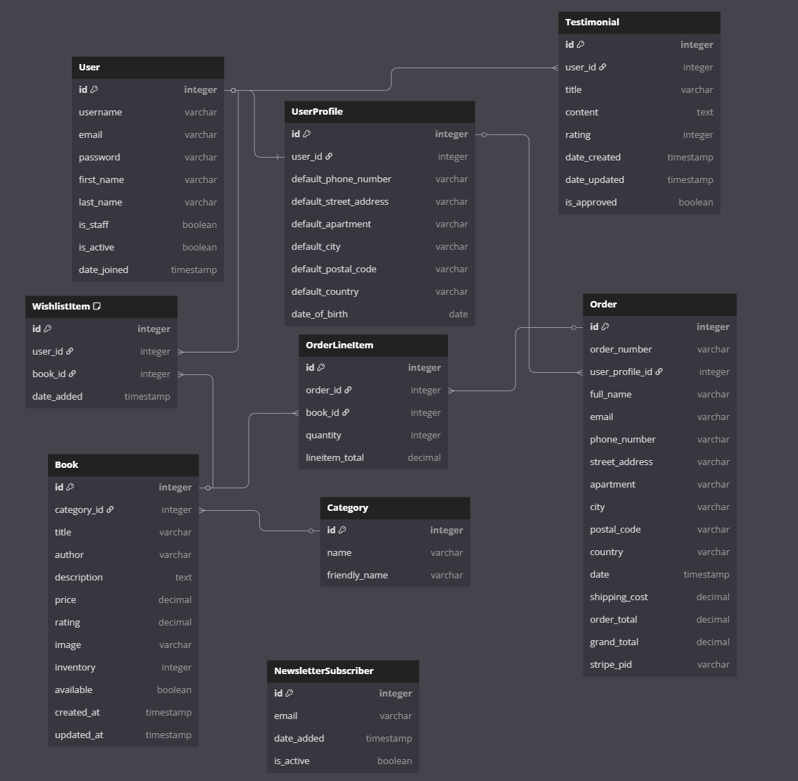

# BookLand

BookLand is an online bookstore platform designed to provide book enthusiasts with a simple, modern, and responsive user experience across all device sizes. Our mission is to make discovering and purchasing books an enjoyable and seamless process.

As avid readers ourselves, we understand the joy of finding the perfect book. BookLand was born out of our passion for literature and our desire to create a digital space where readers can easily browse, purchase, and manage their book orders without the hassle often associated with online shopping.


[View live site here](link-to-deployed-site)

## 📚 Table of Contents 

- [Overview](#overview)
- [Planning](#planning)
  - [Target Audience](#target-audience)
  - [Project Goals](#project-goals)
  - [Feature Planning](#feature-planning)
  - [Technology Stack](#technology-stack)
  - [UI/UX Considerations](#uiux-considerations)
    - [Design Principles](#design-principles)
    - [Accessibility](#accessibility)
    - [Responsive DesignUX](#responsive-designux)
  - [Data Management](#data-management)
    - [User Data](#user-data)
    - [Product Data](#product-data)
    - [Order History](#order-history)
  - [Future Enhancements](#future-enhancements)

- [Design](#design)
  - [Design Philosophy](#design-philosophy)
  - [Color Scheme](#color-scheme)
  - [Typography](#typography)
  - [Imagery](#imagery)
  - [Components and UI Elements](#components-and-ui-elements)
    - [Cards](#cards)  
    - [Buttons](#buttons)
    - [Navigation Elements](#navigation-elements)
    - [Forms](#forms)
  - [Custom Design Elements](#custom-design-elements)
    - [Toast Notifications](#toast-notifications)
    - [Rating Display](#rating-display)
    - [Free Shipping Progress](#free-shipping-progress)
  - [Responsive Design](#responsive-design)
    - [Mobile Experience](#mobile-experience)
    - [Tablet Experience](#tablet-experience)
    - [Desktop Experience](#desktop-experience)
  - [Design System Implementation](#design-system-implementation)
  - [User Interface Flow](#user-interface-flow)
  - [Design for Accessibility](#design-for-accessibility)
  - [Future Design Directions](#future-design-directions)
  - [Design Process Artifacts](#design-process-artifacts)
    - [Wireframes](#wireframes)
  - [Design Implementation Summary](#design-implementation-summary)
- [Database Schema](#database-schema)
  - [Entity Relationship Diagram](#entity-relationship-diagram)
  - [Database Models](#database-models)
    - [User Profile Model](#user-model)
    - [Wishlist Item Model](#wishlist-item-model)
    - [Testimonial Model](#testimonial-model)
    - [Book Model](#book-model)
    - [Category Model](#category-model)
    - [Order Model](#order-model)
    - [Order Line Item Model](#order-line-item-model)
    - [Newsletter Subscriber Model](#newsletter-subscriber-model)
  - [Database Relationships](#database-relationships)
    - [One-to-One Relationships](#one-to-one-relationships)
    - [One-to-Many Relationships](#one-to-many-relationships)
    - [Many-to-Many Relationships](#many-to-many-relationships)
- [Database Optimization](#database-optimization)
- [Database Security](#database-security)
- [Database Schema Evolution](#database-schema-evolution)
- [Future Database Considerations](#future-database-considerations)  
- [Features](#features)
  - [Navigation](#navigation)
    - [Main Menu](#main-menu)
    - [Homepage](#homepage)  
    - [Search Bar](#search-bar)
    - [Filters & Sorting](#filters--sorting)
  - [Product Details](#product-details)
    - [Add to Cart & Wishlist](#add-to-cart--wishlist)
  - [Shopping Cart](#shopping-cart)
  - [Checkout](#checkout))
    - [Order Confirmation](#order-confirmation)
  - [User Profile](#user-profile)
    - [Order History](#order-history-feature)
  - [Testimonials](#testimonials)
  - [Wishlist](#wishlist)
  - [Admin Features](#admin-features)
    - [Inventory Management](#inventory-management)
    - [User Management](#user-management)
  - [Future Features](#future-features)
- [Technologies Used](#technologies-used)
  - [Languages](#languages)
  - [Frameworks and Libraries](#frameworks-and-libraries)
  - [Tools and Platforms](#tools-and-platforms)
  - [Third-Party Services](#third-party-services)
- [Credits](#credits)
  - [Code](#code)
  - [Content](#content)
  - [Media](#media)
  - [Acknowledgements](#acknowledgements)
- [Agile Methodology](#agile-methodology)
- [Deployment](#deployment)
- [Testing](#testing)
- [SEO and Marketing](#seo-and-marketing)

## Overview

BookLand is a sophisticated e-commerce platform designed specifically for book enthusiasts who value a curated literary experience. Unlike mass-market retailers, our store focuses on quality over quantity, specializing in carefully selected titles across philosophy, psychology, literature, biographies, and self-development categories.

Our platform combines elegant simplicity with powerful functionality, creating an intuitive shopping experience that helps readers discover their next great book without overwhelm. The clean, responsive design ensures seamless browsing across all devices, while thoughtful features like wishlist management, detailed book information, and personalized recommendations enhance the discovery process.

BookLand stands apart through its commitment to community building among readers. Our testimonial system allows customers to share their experiences and recommendations, creating a sense of shared literary exploration. The platform's integration with Stripe ensures secure payment processing, while our robust order management system gives users complete visibility into their purchase history.

Developed using Django and Bootstrap, BookLand demonstrates modern web development principles with a focus on performance, security, and user experience. The application implements a comprehensive database schema that efficiently manages user profiles, product information, orders, and customer interactions.

Whether you're seeking philosophical classics, psychological insights, or personal growth literature, BookLand offers a refreshing alternative to algorithm-driven retail experiences—a digital bookstore where thoughtful curation meets seamless technology.


## Planning

### Target Audience

BookLand aims to serve a specific audience of book enthusiasts who value quality over quantity in their reading choices. Our target audience includes:

- Avid readers with specific interests in philosophy, psychology, literature, biographies, and self-development
- Individuals seeking thoughtfully curated book recommendations rather than overwhelming catalogs
- Gift shoppers looking for meaningful book selections for friends and family
- Readers who appreciate an aesthetically pleasing, distraction-free shopping experience
- Customers who value the community aspect of reading and book discussions

Through market research, we determined that this audience segment often feels overwhelmed by mass-market retailers and seeks a more curated experience when discovering new books.

### Project Goals

The primary goals for BookLand are:

1. Streamlined Shopping Experience: Create an intuitive, frictionless book purchasing process from discovery to checkout
2. Thoughtful Curation: Present a carefully selected collection of quality books rather than an overwhelming catalog
3. Community Building: Foster a sense of community among readers through testimonials, newsletter subscription and facebook page
4. Device Flexibility: Ensure a consistent, responsive experience across all device sizes
5. Secure Transactions: Implement robust security measures for user data and payment processing
6. Personalization: Allow users to maintain wishlists and track orders

### Feature Planning

Based on our MoSCoW prioritization (Must Have, Should Have, Could Have, Won't Have), we identified the following feature sets:

#### Must Have Features

- User registration and authentication
- Book browsing and searching
- Shopping cart and checkout functionality
- Secure payment processing
- Admin book management
- Responsive design implementation

#### Should Have Features

- User profiles with order history
- Wishlist functionality
- Email notifications
- Category filtering
- Sorting options

#### Could Have Features

- Newsletter subscription
- Advanced search filters
- Ratings and reviews system
- Related book recommendations
- Social sharing capabilities

#### Won't Have Features

- E-book downloads
- Membership/subscription model
- Author profiles/pages
- Book preview feature
- Language translation options

### Technology Stack

The technology choices for BookLand were made based on reliability, scalability, and developer efficiency:

#### Backend

- Django: Chosen for its robust security features, ORM, and built-in admin panel
- PostgreSQL: Selected for data reliability and advanced querying capabilities
- Python: Core language providing excellent library support and readability

#### Frontend

- Bootstrap: Ensures responsive design and consistent UI components
- HTML/CSS/JavaScript: Core web technologies for structure, styling, and interactivity
- jQuery: Simplifies DOM manipulation and event handling

#### Infrastructure

- Heroku: Provides reliable hosting with seamless deployment
- AWS S3: Handles static and media file storage efficiently
- Stripe: Ensures secure payment processing

### UI/UX Considerations

#### Design Principles

BookLand's design follows these core principles:

1. Simplicity: Clean layouts that focus on book content without distractions
2. Consistency: Uniform design patterns across the site for intuitive navigation
3. Hierarchy: Clear visual hierarchy to guide users through the shopping process
4. Feedback: Immediate visual feedback for user actions (add to cart, wishlist, checkout etc.)
5. Accessibility: High-contrast text and ARIA-compliant components

#### Accessibility

Accessibility was a primary consideration throughout development:

- Semantic HTML5 markup for improved screen reader compatibility
- ARIA roles and labels for interactive elements
- Keyboard navigation support throughout the application
- Color contrast ratios meeting WCAG standards
- Alt text for all images, particularly book covers
- Focus indicators for interactive elements

#### Responsive DesignUx

The platform employs a mobile-first approach with several key breakpoints:

- Mobile devices (< 576px): Stacked layouts, simplified navigation
- Tablets (576px - 991px): Two-column product grids, expanded navigation
- Desktops (992px+): Multi-column layouts, enhanced feature visibility

All interactive elements were designed with touch interfaces in mind, featuring appropriate sizing for tap targets on mobile devices.

### Data Management

#### User Data

BookLand handles the following user data with strict privacy measures:

- Personal information (name, email, encrypted password)
- Shipping addresses
- Order history
- Wishlist selections
- Payment processing (handled securely via Stripe)

All personal data is protected through:

- HTTPS encryption
- Django's built-in security features
- Principle of least privilege for data access
- Clear privacy policy explanations()

#### Product Data
The product catalog is structured around:

- Book details (title, author, description, price)
- Categorization system
- Inventory tracking
- Image storage and optimization
- Rating and review data

#### Order History
The order management system tracks:

- Order creation and fulfillment status
- Line items and quantities
- Payment records
- Shipping details
- Order confirmation communication

### Future Enhancements

Looking beyond the initial release, BookLand has a roadmap for future development:

1. Social Login Integration: Allow users to register and login using social media accounts
2. Advanced Recommendation: Implement personalized book recommendations
3. Author Event Promotions: Feature virtual author readings and Q&A sessions
4. Book Club Functionality: Create community spaces for discussion of selected books
5. Mobile App Development: Create native mobile applications for iOS and Android
6. Enhanced Analytics: Implement advanced user behavior tracking for improved personalization
7. Subscription Service: Develop a monthly book subscription box service

These enhancements will be prioritized based on user feedback and business goals after the initial platform launch.


## Design

The BookLand design approach focused on creating a clean, intuitive, and visually appealing interface that puts the 
books and reading experience at the forefront. Our design decisions were guided by user-centered principles
emphasizing readability, accessibility, and seamless navigation across all device sizes.

### Design Philosophy

The core philosophy behind BookLand's design was to create a digital environment that evokes the calm, focused atmosphere of a curated bookstore, where readers can discover new books without distraction. We prioritized:

- Content-first approach: Placing book covers, titles, and descriptions as the focal points
- Intuitive navigation: Ensuring users can effortlessly find what they're looking for
- Visual hierarchy: Using spacing, typography, and color to guide the user's attention
- White space: Allowing content to breathe, reducing cognitive load
- Consistency: Maintaining uniform design patterns throughout the application

### Color Scheme

BookLand employs a carefully selected color palette that balances warmth with professionalism, creating an inviting atmosphere that helps books stand out:

- Primary Color: Orange (#ff7b00) - Used for call-to-action buttons and accent elements
- Secondary Colors:
  - Dark navy (#2c3e50) - Used for primary text and footer background
  - Light gray (#f8f9fa) - Used for section backgrounds and card elements
  - White (#ffffff) - Used for main backgrounds and to create visual separation

This limited color palette ensures visual consistency while providing sufficient contrast for accessibility. The warm orange highlights important elements like "Add to Cart" buttons, creating clear action points for users.

### Typography

Typography was chosen to balance readability with personality:

- Primary Font: Segoe UI - A clean, modern sans-serif font that renders well across devices and provides excellent readability at various sizes
- Font Hierarchy:
  - Headings: Semi-bold (600) weight with slightly reduced line height
  - Body text: Regular (400) weight with line height (1.6)
  - Small text: Lighter weight (300) for secondary information

Line lengths were carefully controlled across different device sizes to maintain optimal readability (50-75 characters per line where possible).

### Imagery

The visual language of BookLand emphasizes book covers as the primary imagery:

- Book Covers: Treated as the main visual elements, displayed consistently across the site
- Placeholder Design: Custom placeholder designs for books without cover images
- Icon System: Bootstrap Icons were selected for their clean, consistent style and comprehensive coverage of needed UI elements
- Background Elements: Minimal use of background imagery to maintain focus on books
- Image Optimization: All images are optimized for web delivery, with responsive sizes and modern formats

### Components and UI Elements

BookLand features a consistent set of UI components designed for both visual appeal and functionality:

#### Cards
Book cards serve as the primary visual container across the site, featuring:

- Consistent height-to-width ratio for book covers
- Hover effects with subtle elevation changes
- Clear information hierarchy with title, author, and price
- Action buttons consistently positioned at the bottom

#### Buttons
The button system follows a clear hierarchy:

- Primary Actions: Solid orange background (#ff7b00) with white text
- Secondary Actions: Dark outline buttons
- Tertiary Actions: Text-only buttons with hover effects

#### Navigation Elements

- Main Navigation: Clean horizontal layout on desktop, collapsing to hamburger menu on mobile
- Category Navigation: Visually distinct badges that highlight the active category
- Breadcrumbs: Used on product detail pages to provide context

#### Forms
Form elements were designed with special attention to usability:

- Clear, visible labels
- Consistent input styling
- Immediate validation feedback
- Logical tab ordering
- Appropriate input types for different data (email, number, etc.)

### Custom Design Elements

Several custom design elements were created to enhance the BookLand experience:

#### Toast Notifications

Custom toast notifications provide non-intrusive feedback for user actions:

- Success Toasts: Green accent with a shopping cart preview when adding items
- Error Toasts: Red accent with clear error messaging
- Information Toasts: Blue accent for general notifications

#### Rating Display

A custom rating display using star icons provides visual feedback about book ratings.

#### Free Shipping Progress

A dynamic indicator in the cart shows progress toward the free shipping threshold.

### Responsive Design

BookLand was built with a mobile-first approach, ensuring an optimal experience across all device sizes:

#### Mobile Experience
(< 768px)

- Stacked, single-column layouts
- Larger touch targets
- Simplified navigation via hamburger menu
- Optimized product cards for smaller screens
- Full-width buttons for easier interaction

#### Tablet Experience
(768px - 991px)

- Two-column product grids
- Expanded navigation options
- Balanced white space
- Sidebar navigation in user profile areas

#### Desktop Experience
(992px+)

- Multi-column layouts for efficient browsing
- Horizontal navigation with dropdown menus
- Enhanced detail views with side-by-side layouts
- Sticky elements for improved navigation

Each breakpoint was carefully considered to provide the optimal balance of information density and usability for the corresponding device type.

### Design System Implementation

The design system was implemented using:

- Bootstrap 5.3: Providing a responsive grid system and core components
- Custom CSS: Extending Bootstrap with BookLand-specific styling
- JavaScript Enhancements: Adding interactive elements like toast notifications

### User Interface Flow

The interface was designed to guide users through a natural reading and shopping journey:

1. Discovery: Homepage featuring categories and curated selections
2. Browsing: Category pages with filtering and sorting options
3. Examination: Detailed product detail pages with comprehensive information
4. Decision: Clear calls-to-action (Add to Cart, Add to Wishlist)
5. Purchase: Streamlined cart and checkout process
6. Follow-up: Order confirmation and account management

Each step was optimized to minimize friction and enhance the user experience.

### Design for Accessibility

Accessibility was integrated into the design process from the beginning:

- Color Contrast: All text elements meet or exceed WCAG requirements
- Keyboard Navigation: All interactive elements are accessible via keyboard
- Screen Reader Support: Semantic HTML structure and ARIA attributes
- Focus Indicators: Visible focus states for all interactive elements
- Alternative Text: All images include descriptive alt text
- Resizable Text: The interface accommodates increased text size without breaking layouts

### Future Design Directions

The current design lays the groundwork for future enhancements:

- Dark Mode: Framework in place for implementing light/dark theme toggle
- Personalization: UI elements that can adapt to user preferences and behavior
- Animation: Subtle motion design to enhance interactivity and feedback
- Expanded Visualization: Additional data visualization for user statistics and recommendations

### Design Process Artifacts

The design process included multiple iterations and testing phases:


#### Wireframes

The main entry point featuring category navigation and featured books
[Home page medium+](media/wireframes/Home%20Page%20Medium%20Plus.png)

Mobile-optimized version with adapted navigation pattern
[Home page mobile](media/wireframes/Home%20Page%20Mobile.png)

Streamlined form with order summary
[Checkout page shipping](media/wireframes/Checkout%20Page%20Shipping%20info%20and%20order%20summary.png)

Clear order details
[Order confirmation](media/wireframes/Order%20Confirmation%20Page.png)

Comprehensive book information with action buttons
[Product details medium+](media/wireframes/Product%20Details%20Medium%20Plus.png)

Streamlined mobile view with essential information
[Product details mobile](media/wireframes/Product%20details%20mobile.png)

User account settings and preferences
[Profile management](media/wireframes/Profile%20Management.png)

Cart management with item listing and summary
(The order summary was repositioned from below to the right side of the shopping cart page to enhance usability by allowing users to view order details alongside the form simultaneously.)
[Shopping cart page](media/wireframes/Shopping%20Cart%20Page.png) 

User registration form
[Sign up](media/wireframes/Sign%20up.png)

Authentication form
[Login/Sign-In](media/wireframes/Login.png)

Saved items for future consideration
[Wishlist](media/wireframes/Wishlist.png)

In the final implementation, we made some refinements to the original wireframes. For instance, on the Shopping Cart page, we moved the cart summary from a left sidebar to a right-positioned card on larger screens to improve the visual balance and align with common e-commerce patterns users are familiar with. This adjustment enhanced usability while maintaining the essential functionality outlined in the wireframes. The "Add to Cart" button was replaced with a shopping cart icon to streamline the interface and improve the overall user experience.

### Design Implementation Summary

The BookLand design implementation successfully created a cohesive, user-friendly interface that supports the core project goals:

1. Streamlined Experience: Clean layouts and clear visual hierarchy guide users through the shopping process
2. Thoughtful Curation: Design elements emphasize quality over quantity, with focused presentation of each book
3. Community Focus: UI components for testimonials and user interaction enhance the sense of shared experience
4. Device Flexibility: Responsive design ensures consistency across all screen sizes
5. Trust and Security: Professional design elements reinforce the security of the shopping experience

The resulting design creates an atmosphere that encourages exploration and discovery, helping readers find their next great book in an enjoyable, frustration-free environment.


## Database Schema

### Entity Relationship Diagram

The database schema for BookLand is designed to efficiently support all the core functionality while maintaining data integrity and optimal performance. Below is the entity relationship diagram showing how different models are interconnected:

Created with [diagram io](https://dbdiagram.io/home)



### Database Models

The BookLand platform uses Django's ORM with the following models to organize and manage data efficiently:

#### User Profile Model

The UserProfile model extends Django's built-in User model to store additional customer information:

```python
class UserProfile(models.Model):
    user = models.OneToOneField(User, on_delete=models.CASCADE)
    default_phone_number = models.CharField(max_length=20, null=True, blank=True)
    default_street_address = models.CharField(max_length=80, null=True, blank=True)
    default_apartment = models.CharField(max_length=80, null=True, blank=True)
    default_city = models.CharField(max_length=40, null=True, blank=True)
    default_postal_code = models.CharField(max_length=20, null=True, blank=True)
    default_country = models.CharField(max_length=40, null=True, blank=True)
    date_of_birth = models.DateField(null=True, blank=True)
```

**Key features**:

- One-to-one relationship with Django's User model
- Stores default delivery information to streamline checkout
- Optional fields allow flexibility in user data collection
- Signal receivers automatically create/update profiles when users are created/modified

#### Wishlist Item Model

The WishlistItem model tracks books that users have saved for future consideration:

```python
class WishlistItem(models.Model):
    user = models.ForeignKey(User, on_delete=models.CASCADE)
    book = models.ForeignKey(Book, on_delete=models.CASCADE)
    date_added = models.DateTimeField(auto_now_add=True)

    class Meta:
        unique_together = ('user', 'book')
        ordering = ['-date_added']
```

**Key features**:

- Many-to-many relationship between users and books
- Enforces uniqueness to prevent duplicate wishlist entries
- Tracks when items were added for sorting purposes
- Cascade deletion ensures data integrity when users or books are removed

#### Testimonial Model

The Testimonial model allows users to share their BookLand experiences:

```python
class Testimonial(models.Model):
    user = models.ForeignKey(User, on_delete=models.CASCADE, related_name='testimonials')
    title = models.CharField(max_length=100)
    content = models.TextField()
    rating = models.IntegerField(
        validators=[MinValueValidator(1), MaxValueValidator(5)],
        help_text="Rating from 1 to 5 stars"
    )
    date_created = models.DateTimeField(auto_now_add=True)
    date_updated = models.DateTimeField(auto_now=True)
    is_approved = models.BooleanField(default=False)
```

**Key features**:

- Foreign key to User model for author tracking
- Rating field with validators to ensure values between 1-5
- Moderation system through is_approved flag
- Automatic timestamp tracking for creation and updates
- Custom model ordering by most recent updates

#### Book Model

The Book model is central to the entire platform, storing all product information:

```python
class Book(models.Model):
    category = models.ForeignKey('Category', null=True, blank=True, on_delete=models.SET_NULL)
    title = models.CharField(max_length=255)
    author = models.CharField(max_length=255)
    description = models.TextField()
    price = models.DecimalField(max_digits=6, decimal_places=2)
    rating = models.DecimalField(max_digits=3, decimal_places=1, null=True, blank=True,
                                validators=[MinValueValidator(0), MaxValueValidator(5)])
    image = models.ImageField(null=True, blank=True)
    inventory = models.IntegerField(default=0)
    available = models.BooleanField(default=True)
    created_at = models.DateTimeField(auto_now_add=True)
    updated_at = models.DateTimeField(auto_now=True)
```

**Key features**:

- Foreign key to Category with SET_NULL to preserve books if categories are deleted
- Comprehensive product details including pricing and inventory status
- Image field for book covers with automatic WebP conversion on save
- Validation for ratings to ensure they stay within 0-5 range
- Timestamps for tracking when books are added or updated

#### Category Model

The Category model organizes books into logical groupings:

```python
class Category(models.Model):
    name = models.CharField(max_length=100, unique=True)
    friendly_name = models.CharField(max_length=100, null=True, blank=True)

    class Meta:
        verbose_name_plural = 'Categories'
```

**Key features**:

- Simple model with machine-readable name and human-friendly display name
- Enforces uniqueness to prevent duplicate categories
- Custom plural name for proper display in Django admin
- Helper method for retrieving friendly name with fallback to standard name

#### Order Model

The Order model tracks customer purchases and delivery information:

```python
class Order(models.Model):
    order_number = models.CharField(max_length=32, null=False, editable=False)
    user_profile = models.ForeignKey(UserProfile, on_delete=models.SET_NULL, 
                                    null=True, blank=True, related_name='orders')
    full_name = models.CharField(max_length=50, null=False, blank=False)
    email = models.EmailField(max_length=254, null=False, blank=False)
    phone_number = models.CharField(max_length=20, null=False, blank=False)
    street_address = models.CharField(max_length=80, null=False, blank=False)
    apartment = models.CharField(max_length=80, null=True, blank=True)
    city = models.CharField(max_length=40, null=False, blank=False)
    postal_code = models.CharField(max_length=20, null=False, blank=False)
    country = models.CharField(max_length=40, null=False, blank=False)
    date = models.DateTimeField(auto_now_add=True)
    shipping_cost = models.DecimalField(max_digits=6, decimal_places=2, null=False, default=5)
    order_total = models.DecimalField(max_digits=10, decimal_places=2, null=False, default=0)
    grand_total = models.DecimalField(max_digits=10, decimal_places=2, null=False, default=0)
    stripe_pid = models.CharField(max_length=254, null=True, blank=True, default='')
```

**Key features**:

- UUID-based unique order number generation
- Foreign key to UserProfile with SET_NULL to preserve order history even if profiles are deleted
- Comprehensive delivery details captured even for guest checkouts
- Financial tracking fields for order totals, shipping costs, and grand totals
- Stripe payment intent ID for reconciliation with payment processor
- Custom save method to ensure order numbers are generated when needed
- Update_total method to recalculate based on line items

#### Order Line Item Model

The OrderLineItem model represents individual books within an order:

```python
class OrderLineItem(models.Model):
    order = models.ForeignKey(Order, null=False, blank=False, on_delete=models.CASCADE, related_name='lineitems')
    book = models.ForeignKey(Book, null=False, blank=False, on_delete=models.CASCADE)
    quantity = models.IntegerField(null=False, blank=False, default=0)
    lineitem_total = models.DecimalField(max_digits=6, decimal_places=2, null=False, blank=False, editable=False)
```

**Key features**:

- Foreign keys to both Order and Book models
- Automatic calculation of line item totals based on book price and quantity
- Cascade deletion ensures line items are removed if the parent order is deleted
- Custom save method to calculate lineitem_total before saving
- Signal handlers to update order totals when line items change

#### Newsletter Subscriber Model

The NewsletterSubscriber model tracks email subscriptions:

```python
class NewsletterSubscriber(models.Model):
    email = models.EmailField(unique=True)
    date_added = models.DateTimeField(auto_now_add=True)
    is_active = models.BooleanField(default=True)
```

**Key features**:

- Unique email field to prevent duplicate subscriptions
- Timestamp for subscription date
- Active flag for subscription management
- Simple model design focused on primary newsletter functionality

### Database Relationships

The BookLand database schema incorporates several key relationships:

#### One-to-One Relationships

- User to UserProfile: Each Django User has exactly one UserProfile

#### One-to-Many Relationships

- Category to Book: Each Book belongs to one Category; Categories can have many Books
- UserProfile to Order: Each Order is associated with one UserProfile; UserProfiles can have many Orders
- Order to OrderLineItem: Each OrderLineItem belongs to one Order; Orders can have many OrderLineItems
- Book to OrderLineItem: Each OrderLineItem references one Book; Books can appear in many OrderLineItems
- User to Testimonial: Each Testimonial is written by one User; Users can write many Testimonials

#### Many-to-Many Relationships

- User to Book via WishlistItem: Users can wishlist many Books; Books can be wishlisted by many Users

### Database Optimization

Several optimization strategies were implemented in the database design:

1. Indexing: Key lookup fields like order_number, email, and foreign keys are indexed for faster queries
2. Query Optimization: Context processors are designed to minimize database hits
3. Selective Related/Prefetch: Views use select_related and prefetch_related to reduce query count
4. Data Denormalization: Strategic redundancy allows for fewer joins in common queries
5. Cascade Deletion: Appropriate on_delete options maintain data integrity while minimizing orphaned records

### Database Security

To protect customer and business data, several security measures are implemented:

1. Stripe Integration: Payment details are never stored in our database, only necessary references
2. Field Validation: Strict validation on input fields to prevent injection attacks
3. Parameterized Queries: Django's ORM handles safe query construction
4. Permission Controls: Field-level permissions control what data is accessible to different user types
5. Data Minimization: Only essential customer information is collected and stored

### Database Schema Evolution

The current schema evolved through several iterations during development:

1. Initial Models: Basic User, Book, and Order models
2. First Extension: Addition of Category and OrderLineItem models
3. Feature Expansion: Introduction of WishlistItem and Testimonial models
4. Refinement: Field adjustments and relationship optimizations based on real-world testing
5. Final Iteration: Addition of newsletter functionality and optimization of existing models

### Future Database Considerations

For future development, the following database enhancements are planned:

1. Caching Layer: Redis integration for frequent queries
2. Read Replicas: Database replication for high-traffic scenarios
3. Analytics Tables: Dedicated tables for business intelligence without affecting operational performance
4. Full-Text Search: PostgreSQL full-text search capabilities for improved book discovery
5. Internationalization: Language-specific fields for multi-language support

The BookLand database schema balances complexity with performance, providing a solid foundation for the e-commerce platform while maintaining flexibility for future growth and feature expansion.


## Features


### Navigation


#### Main Menu


#### Homepage 


#### Search Bar


#### Filters & Sorting