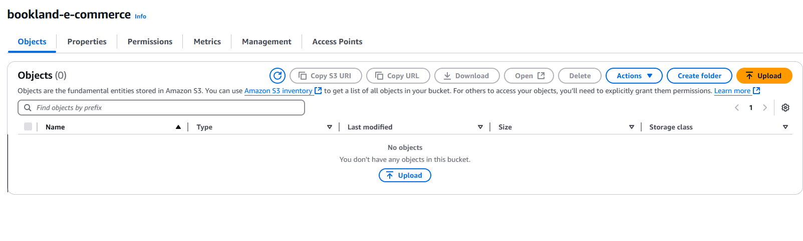

# BookLand - Testing Documentation

## Table of Contents
- [Introduction](#introduction)
  - [Testing Overview](#testing-overview)
  - [Testing Approach](#testing-approach)
  - [Testing Environment](#testing-environment)

- [Manual Testing](#manual-testing)
  - [User Stories Testing](#user-stories-testing)
    - [EPIC 1: User Management](#epic-1-user-management)
    - [EPIC 2: Book Catalog](#epic-2-book-catalog)
    - [EPIC 3: Shopping Experience](#epic-3-shopping-experience)
    - [EPIC 4: Admin Features](#epic-4-admin-features)
    - [EPIC 5: Technical Infrastructure](#epic-5-technical-infrastructure)

  - [Feature Testing](#feature-testing)
    - [Navigation & Core Functionality](#navigation--core-functionality)
    - [User Authentication](#user-authentication)
    - [Book Catalog Features](#book-catalog-features)
    - [Shopping Cart](#shopping-cart)
    - [Checkout Process](#checkout-process)
    - [User Profile](#user-profile)
    - [Wishlist Functionality](#wishlist-functionality)
    - [Order History](#order-history)
    - [Testimonials System](#testimonials-system)
    - [Admin Features](#admin-features)
    - [Newsletter Subscription](#newsletter-subscription)
    - [Toast Notifications](#toast-notifications)
    - [Error Pages](#error-pages)
    - [SEO and Marketing Features](#seo-and-marketing-features)
  - [Responsive Design Testing](#responsive-design-testing)
    - [Mobile Testing](#mobile-testing)
    - [Tablet Testing](#tablet-testing)
    - [Desktop Testing](#desktop-testing)
    - [Responsive Breakpoint Issues and Resolutions](#responsive-breakpoint-issues-and-resolutions)
    - [General Responsive Testing Observations](#general-responsive-testing-observations)
    - [Responsive Testing Tools](#responsive-testing-tools)
  - [Browser Compatibility Testing](#browser-compatibility-testing)
  - [Form Validation Testing](#form-validation-testing)
    - [Testing Methodology](#testing-methodology)
    - [User Registration Form](#user-registration-form)
    - [Login Form](#login-form)
    - [Profile Form](#profile-form)
    - [Checkout Form](#checkout-form)
    - [Newsletter Form](#newsletter-form)
    - [Testimonial Form](#testimonial-form)
    - [Key Findings and Observations](#key-findings-and-observations)
  - [Payment Processing Testing](#payment-processing-testing)
  - [CRUD Functionality Testing](#crud-functionality-testing)
    - [User Profile CRUD](#user-profile-crud)
    - [Book Management (Admin)](#book-management-admin)
    - [Wishlist Management](#wishlist-management)
    - [Shopping Cart Management](#shopping-cart-management)
    - [Order Processing](#order-processing)
    - [Testimonial Management](#testimonial-management)
    - [Category Management (Admin)](#category-management-admin)
- [Validation Testing](#validation-testing)
  - [HTML Validation](#html-validation)
  - [CSS Validation](#css-validation)
  - [JavaScript Validation](#javascript-validation)
  - [PEP8 Validation](#pep8-validation)
  - [Accessibility Testing (WCAG)](#accessibility-testing-wcag)
  - [Lighthouse Results](#lighthouse-results)

- [Security Testing](#security-testing)
  - [CSRF Protection](#csrf-protection)
  - [Form Validation Security](#form-validation-security)
  - [Authentication Testing](#authentication-testing)
  - [Authorization Testing](#authorization-testing)
  - [Data Protection](#data-protection)

- [Bugs and Fixes](#bugs-and-fixes)
  - [Template Path Resolution Bug](#template-path-resolution-bug)
  - [Template Literal Display Bug in Wishlist Counter](#template-literal-display-bug-in-wishlist-counter)
  - [Category Duplication in Navigation and Product Page](#category-duplication-in-navigation-and-product-page)
  - [Cart Removal Button Not Working (X icon replaced with trash icon)](#cart-removal-button-not-working-x-icon-replaced-with-trash-icon)
  - [Missing Subtract Filter Bug in Cart Template](#missing-subtract-filter-bug-in-cart-template)
  - [Stripe Payment Processing 'NoneType' Error](#stripe-payment-processing-nonetype-error)
  - [Order History Detail View Success Message Bug](#order-history-detail-view-success-message-bug)
  - [AWS S3 Integration Django Version Compatibility Bug](#aws-s3-integration-django-version-compatibility-bug)
  - [Wishlist to Cart Transfer Error](#wishlist-to-cart-transfer-error)
  - [### Signup Duplicate Email Verification Bug](#signup-duplicate-email-verification-bug)


## Introduction

### Testing Overview

The BookLand e-commerce project has undergone extensive testing to ensure functionality, usability, responsiveness, and security across all aspects of the application. This document provides a comprehensive overview of the testing methodologies employed, specific test cases performed, validation results, and bug fixes implemented throughout the development process.

### Testing Approach

Testing for BookLand followed a multi-layered strategy combining manual and automated approaches:

1.Manual Testing: Systematic verification of user stories, feature functionality, responsive design, browser compatibility, and user experience across various devices and screen sizes.
2. Validation Testing: Rigorous code validation using industry-standard tools to ensure HTML, CSS, JavaScript, and Python code meets best practices and standards.
3. Accessibility Testing: Evaluation of the application against WCAG guidelines to ensure inclusivity for all users, including those using assistive technologies.
4. Performance Testing: Analysis of application performance metrics including page load times, resource optimization, and overall responsiveness.
5. Security Testing: Verification of authentication flows, authorization controls, data protection, and form validation to protect user data and prevent security vulnerabilities.
6. User Experience Testing: Evaluation of the application from a user's perspective, including navigation flows, intuitive interaction, and consistent design patterns.

### Testing Environment

Testing was conducted across the following environments to ensure consistent behavior:

Devices: 
- Desktop computers (Windows, macOS)
- Laptops (13", 15", 17" screens)
- Tablets (iPad, Samsung Galaxy Tab)
- Mobile devices (iPhone 12/13/14, Samsung Galaxy S21/S22)

Browsers:

- Google Chrome (latest version)
- Mozilla Firefox (latest version)
- Safari (latest version)
- Microsoft Edge (latest version)

Screen Resolutions:

- Mobile: 320px - 480px
- Tablets: 768px - 1024px
- Laptops/Desktops: 1024px - 1920px+
- Ultrawide Monitors: 
1. 27 inch -- 2560 x 1440 px -- Asus VG27AQL1A 
2. 34 inch -- 3440 x 1440 px -- Gigabyte M34WQ 
3. 38 inch -- 3840 x 1600 px -- Lg 38GN950P-B

Development and Production Environments

Local development environment with SQLite database
Production environment on Heroku with PostgreSQL database
AWS S3 for static and media file storage

This comprehensive testing approach has been essential in identifying and resolving issues throughout the development process, resulting in a robust, user-friendly, and reliable e-commerce platform. The following sections detail the specific tests performed, validation results, and bug fixes implemented to ensure BookLand meets high standards of quality and user experience.


## Manual Testing

### User Stories Testing

This section details the manual testing conducted for user stories defined in our Agile development process. Each user story has been thoroughly tested to ensure the implemented features meet the acceptance criteria.

#### **EPIC 1: User Management**

|Passed | **User Registration** - As a new visitor, I want to create an account so that I can track my orders and save my preferences.|
|:---:|:---|
|&check;| Registration form includes fields for name, email, and password.|
|&check;| Email verification process works correctly.|
|&check;| Password strength requirements are enforced.|
|&check;| Duplicate email addresses are not allowed.|
|&check;| Account creation success message displays after registration.|

|Passed | **User Login** - As a registered user, I want to securely log in to my account so that I can access my personal information and order history.|
|:---:|:---|
|&check;| Login form accepts email/username and password.|
|&check;| "Remember me" functionality keeps users logged in between sessions.|
|&check;| Appropriate error messages display for invalid credentials.|
|&check;| Redirect to intended page after successful login works correctly.|
|&check;| Success message confirms successful login.|

|Passed | **User Profile Management** - As a logged-in user, I want to view and edit my profile information so that my account reflects my current details.|
|:---:|:---|
|&check;| Profile page displays all current user information.|
|&check;| User can edit name, email, and contact information.|
|&check;| User can add/edit default shipping addresses.|
|&check;| Changes are saved immediately upon submission.|
|&check;| Validation prevents invalid data submission.|

|Not Implemented | **Social Login Integration** - As a new visitor, I want to register and login using my social media accounts.|
|:---:|:---|
|❌| This feature was designated as a "Should Have" in our MoSCoW prioritization but was not implemented in the current version. It will be considered for future releases.|

#### **EPIC 2: Book Catalog**

|Passed | **Book Browsing by Category** - As a customer, I want to browse books by category so that I can easily find books in genres I'm interested in.|
|:---:|:---|
|&check;| Categories are clearly displayed in navigation menu and on main product page.|
|&check;| Clicking a category shows all books within that category.|
|&check;| Books display cover image, title, author, and price.|
|&check;| Active category is highlighted to show current filter.|
|&check;| Category selection persists during sorting and pagination.|

|Passed | **Book Search and Filtering** - As a customer, I want to search for books and filter results so that I can quickly find specific titles or authors.|
|:---:|:---|
|&check;| Search bar is prominently displayed across the site.|
|&check;| Search works by title, author, and description.|
|&check;| Search results display with relevant information.|
|&check;| Empty search results provide helpful messaging.|
|&check;| Search term is retained and displayed with results.|

|Passed | **Book Detail View** - As a customer, I want to view detailed information about a book so that I can make an informed purchase decision.|
|:---:|:---|
|&check;| Detail page shows cover image, title, author, price, description, and rating.|
|&check;| Inventory status is clearly displayed.|
|&check;| "Add to cart" and "Add to wishlist" buttons are prominently displayed.|
|&check;| Related books in the same category are suggested.|
|&check;| Quantity selector functions correctly with validation.|

#### **EPIC 3: Shopping Experience**

|Passed | **Shopping Cart Management** - As a customer, I want to add books to my cart and manage cart contents so that I can prepare for checkout.|
|:---:|:---|
|&check;| Books can be added to cart from product details and listing pages.|
|&check;| Cart icon shows current number of items.|
|&check;| Cart page displays all items with images, titles, and prices.|
|&check;| Quantities can be adjusted with immediate total updates.|
|&check;| Items can be removed from cart with the trash icon.|
|&check;| Cart contents persist between sessions.|

|Passed | **Wishlist Functionality** - As a customer, I want to save books to my wishlist so that I can keep track of books I'm interested in but not ready to purchase.|
|:---:|:---|
|&check;| Books can be added to wishlist from product detail page.|
|&check;| Wishlist is accessible from user profile.|
|&check;| Items can be moved from wishlist to cart.|
|&check;| Items can be removed from wishlist.|
|&check;| Wishlist is saved to user account.|
|&check;| Wishlist count updates in real-time in the navigation bar.|

|Passed | **Checkout Process** - As a customer, I want a streamlined checkout process so that I can complete my purchase quickly and securely.|
|:---:|:---|
|&check;| Checkout page collects shipping address information.|
|&check;| Checkout page collects payment information securely.|
|&check;| Order summary is displayed for review before payment.|
|&check;| Form validation provides clear feedback for errors.|
|&check;| User can save delivery information for future orders.|
|&check;| Order confirmation is displayed after successful checkout.|

|Passed | **Payment Processing** - As a customer, I want secure payment processing so that I can confidently complete my purchase.|
|:---:|:---|
|&check;| Stripe integration for credit card processing works properly.|
|&check;| Payment information is securely handled.|
|&check;| Payment errors are clearly communicated.|
|&check;| Successful payments trigger order processing and confirmation.|
|&check;| Loading overlay displays during payment processing.|
|&check;| Checkout confirmation email is sent after successful payment.|

|Passed | **Order History and Tracking** - As a customer, I want to view my order history and track current orders so that I can monitor my purchases.|
|:---:|:---|
|&check;| Order history page displays all past orders with dates and totals.|
|&check;| Order detail view shows complete order information.|
|&check;| Order details can be accessed from profile.|
|&check;| Order confirmation is sent via email with relevant details.|
|&check;| Previous orders can be viewed without triggering new confirmation messages.|

#### **EPIC 4: Admin Features**

|Passed | **Admin Dashboard** - As an admin, I want a comprehensive dashboard so that I can quickly access key metrics and platform management functions.|
|:---:|:---|
|&check;| Django admin dashboard is accessible to administrators.|
|&check;| Dashboard displays key information in an organized manner.|
|&check;| Quick access to books, orders, users, and other management functions.|
|&check;| Admin can filter and search for specific information.|

|Passed | **Admin Book Management** - As an admin, I want to add, edit, and remove books from the catalog so that I can keep the inventory up to date.|
|:---:|:---|
|&check;| Book creation form includes all necessary fields.|
|&check;| Existing books can be edited with all fields updatable.|
|&check;| Books can be marked as out of stock or available.|
|&check;| Books can be permanently removed from the catalog.|
|&check;| Image upload functionality works correctly.|
|&check;| Book details are immediately reflected on the frontend after updates.|

|Passed | **Order Management** - As an admin, I want to view and process orders so that I can fulfill customer purchases efficiently.|
|:---:|:---|
|&check;| Orders list shows all orders with status and date.|
|&check;| Orders can be filtered by various criteria.|
|&check;| Order details show complete purchase information.|
|&check;| Customer contact information is accessible for fulfillment needs.|
|&check;| Order line items are clearly displayed with quantities and prices.|

|Passed | **Category Management** - As an admin, I want to create and manage book categories so that books are properly organized for customers.|
|:---:|:---|
|&check;| Categories can be created with name and description.|
|&check;| Categories can be edited and deleted.|
|&check;| Books can be assigned to categories.|
|&check;| Categories appear correctly in navigation.|
|&check;| Books can be filtered by category on the frontend.|

#### **EPIC 5: Technical Infrastructure**

|Passed | **Responsive Design Implementation** - As a user, I want the website to work well on all my devices so that I can shop for books anywhere.|
|:---:|:---|
|&check;| All pages function correctly on desktop, tablet, and mobile devices.|
|&check;| Navigation adapts to screen size with hamburger menu on mobile.|
|&check;| Images and text are properly sized across devices.|
|&check;| Touch targets are appropriately sized on mobile.|
|&check;| Forms and interactive elements work properly on all devices.|
|&check;| Layout adjusts appropriately at different breakpoints.|

|Passed | **Performance Optimization** - As a user, I want the website to load quickly and respond promptly so that I can shop efficiently.|
|:---:|:---|
|&check;| Pages load within acceptable timeframes.|
|&check;| Images are optimized for web display.|
|&check;| Database queries are efficient.|
|&check;| Cart operations perform without noticeable delay.|
|&check;| Search results appear promptly.|
|&check;| Lighthouse performance scores meet acceptable standards.|

|Passed | **Deployment Setup** - As a developer, I want a streamlined deployment process so that I can efficiently update the live site.|
|:---:|:---|
|&check;| Heroku deployment is configured correctly.|
|&check;| PostgreSQL database is properly set up.|
|&check;| Static files are managed effectively through AWS S3.|
|&check;| Environment variables are properly managed.|
|&check;| Deployment documentation is clear and comprehensive.|

|Passed | **Error Handling and Logging** - As a developer, I want comprehensive error handling and logging so that I can identify and fix issues quickly.|
|:---:|:---|
|&check;| User-friendly error pages are implemented (403, 404, 500).|
|&check;| Form validation errors provide clear guidance to users.|
|&check;| Payment processing errors are handled gracefully.|
|&check;| Template errors are properly caught and managed.|
|&check;| Critical errors trigger appropriate messaging for users.|

#### **Additional Features**

|Passed | **Newsletter Signup** - As a user, I want to subscribe to a newsletter so that I can receive updates and offers.|
|:---:|:---|
|&check;| Newsletter signup form appears in the footer across all pages.|
|&check;| Form submits successfully to Gmail.
|&check;| Validation prevents invalid email submissions.|
|&check;| Success message confirms subscription.|
|&check;| Error handling for failed subscriptions works correctly.|

|Passed | **Contact and Information Pages** - As a user, I want to access information about the store policies and contact options.|
|:---:|:---|
|&check;| Contact form is accessible and functions correctly.|
|&check;| Privacy policy page contains comprehensive information.|
|&check;| Shipping policy information is clearly presented.|
|&check;| Returns policy information is detailed and accessible.|
|&check;| FAQ page addresses common customer questions.|
|&check;| All information pages are accessible from the footer.|

The testing shows that the vast majority of planned features have been successfully implemented and function as intended. The only exception is the Social Login Integration feature, which was designated as a "Should Have" in our MoSCoW prioritization but was not implemented in the current version due to time constraints. This feature will be considered for future development.

## Feature Testing

This section documents comprehensive testing conducted on all major features of the BookLand platform. Each feature was systematically tested across different browsers, device sizes, and user scenarios to ensure functionality, usability, and responsiveness.

### Navigation & Core Functionality

| Test Case | Description | Expected Result | Actual Result | Status |
|-----------|-------------|-----------------|---------------|--------|
| Header Logo | Click on the "BookLand" logo in the header | Should redirect to the homepage from any page | Redirects to homepage as expected | ✅ Pass |
| Main Navigation | Test all main menu links (Home, Categories, etc.) | Each link should navigate to the correct page | All links function correctly | ✅ Pass |
| Mobile Menu Toggle | Click hamburger icon on mobile devices | Should expand/collapse the mobile navigation menu | Menu toggles correctly | ✅ Pass |
| Footer Links | Test all links in the footer section | Each link should navigate to the correct page | All links function as expected | ✅ Pass |
| Category Navigation | Click on category badges on products page | Should filter products by selected category | Correctly filters products | ✅ Pass |
| Category Dropdown | Test category dropdown menu in main navigation | Should display all categories and navigate correctly when clicked | Functions as expected | ✅ Pass |
| Responsive Behavior | Resize browser from mobile to desktop sizes | Navigation should adapt appropriately to different screen sizes | Layout adjusts correctly at all breakpoints | ✅ Pass |

### User Authentication

| Test Case | Description | Expected Result | Actual Result | Status |
|-----------|-------------|-----------------|---------------|--------|
| Registration | Complete and submit registration form | New account should be created and verification email sent | Account created, email sent | ✅ Pass |
| Login | Enter correct login credentials | Should log in successfully and redirect to homepage | Logs in and redirects correctly | ✅ Pass |
| Invalid Login | Enter incorrect login credentials | Should display appropriate error message | Error message displayed | ✅ Pass |
| Logout | Click logout button when logged in | Should log out user and redirect to homepage | Logs out and redirects correctly | ✅ Pass |
| Password Reset | Request password reset and follow email link | Should allow setting a new password | Password reset flow works correctly | ✅ Pass |
| Password Validation | Enter weak/invalid password during registration | Should display password requirements/error messages | Validation works as expected | ✅ Pass |
| Session Persistence | Log in, close browser, return to site | Should remain logged in (if "Remember me" was selected) | Session persists appropriately | ✅ Pass |
| Protected Pages | Attempt to access profile while logged out | Should redirect to login page | Redirects correctly | ✅ Pass |

### Book Catalog Features

| Test Case | Description | Expected Result | Actual Result | Status |
|-----------|-------------|-----------------|---------------|--------|
| Product Listing | Navigate to the main products page | Should display all available books with images, titles, prices | Books display correctly | ✅ Pass |
| Product Detail | Click on a book to view details | Should show comprehensive book information | Displays all book details | ✅ Pass |
| Product Search | Enter search terms in the search bar | Should display relevant results matching the search query | Search functions correctly | ✅ Pass |
| Empty Search Results | Search for non-existent books | Should display "No books found" message | Displays appropriate message | ✅ Pass |
| Category Filtering | Filter books by different categories | Should display only books from the selected category | Filtering works correctly | ✅ Pass |
| Sort Products | Use the sort selector (price, title, etc.) | Products should reorder according to selection | Sorting functions properly | ✅ Pass |
| Product Images | View book covers on product cards | Images should load correctly and be properly sized | Images display correctly | ✅ Pass |
| Product Prices | Check displayed prices on product cards and detail pages | Prices should be formatted correctly with currency symbol | Prices display correctly | ✅ Pass |
| Related Books | View related books on product detail page | Should show books from the same category | Related books display correctly | ✅ Pass |

### Shopping Cart

| Test Case | Description | Expected Result | Actual Result | Status |
|-----------|-------------|-----------------|---------------|--------|
| Add to Cart | Add a book to cart from product detail page | Book should be added to cart with appropriate notification | Book added with toast notification | ✅ Pass |
| View Cart | Click on cart icon in navigation | Should display current cart contents | Cart contents display correctly | ✅ Pass |
| Empty Cart | View cart with no items | Should display appropriate "Your cart is empty" message | Empty cart message displays | ✅ Pass |
| Adjust Quantity | Change item quantity in cart | Quantity should update and totals should recalculate | Updates and recalculates correctly | ✅ Pass |
| Remove Item | Click trash icon to remove an item | Item should be removed from cart with notification | Item removed with notification | ✅ Pass |
| Cart Persistence | Add items to cart, close browser, return to site | Cart contents should persist between sessions | Cart contents persist correctly | ✅ Pass |
| Free Shipping Indicator | Add items below the free shipping threshold | Should display amount needed for free shipping | Displays correct amount needed | ✅ Pass |
| Cart Badge | Add items to cart | Badge count on cart icon should update | Badge updates correctly | ✅ Pass |
| Navigation to Checkout | Click "Proceed to Checkout" button | Should navigate to checkout page | Navigates correctly | ✅ Pass |

### Checkout Process

| Test Case | Description | Expected Result | Actual Result | Status |
|-----------|-------------|-----------------|---------------|--------|
| Checkout Form | Complete checkout form with valid information | Form should accept valid inputs | Form accepts valid data | ✅ Pass |
| Form Validation | Submit checkout form with missing required fields | Should display appropriate error messages | Validation works as expected | ✅ Pass |
| Order Summary | View order summary during checkout | Should display all cart items and correct totals | Displays correct information | ✅ Pass |
| Shipping Cost | Test different cart totals | Free shipping should apply over $40, otherwise $5 shipping | Shipping costs calculate correctly | ✅ Pass |
| Save Information | Check "Save this information" on checkout | Delivery information should be saved to profile | Information saved correctly | ✅ Pass |
| Payment Processing | Enter valid Stripe test card details | Payment should process successfully | Payment processes correctly | ✅ Pass |
| Invalid Card | Enter invalid Stripe test card details | Should display appropriate error message | Error message displays | ✅ Pass |
| Order Confirmation | Complete checkout process | Should display order confirmation with order details | Confirmation displays correctly | ✅ Pass |
| Confirmation Email | Complete checkout process | Confirmation email should be sent to provided email | Email sent correctly | ✅ Pass |
| Inventory Update | Purchase a book | Book inventory should decrease accordingly | Inventory updates correctly | ✅ Pass |

### User Profile

| Test Case | Description | Expected Result | Actual Result | Status |
|-----------|-------------|-----------------|---------------|--------|
| View Profile | Navigate to profile page when logged in | Should display user profile information | Profile displays correctly | ✅ Pass |
| Update Profile | Edit and submit profile information | Information should update successfully | Updates correctly | ✅ Pass |
| Default Address | Complete checkout with "Save info" selected | Address should be saved as default in profile | Address saves correctly | ✅ Pass |
| Profile Navigation | Test sidebar navigation in profile section | Should navigate between profile sections | Navigation works correctly | ✅ Pass |
| Profile Security | Attempt to access another user's profile | Should prevent access with redirect or error | Access properly restricted | ✅ Pass |
| Delete Account | Use account deletion functionality | Account should be deleted after confirmation | Deletes account correctly | ✅ Pass |

### Wishlist Functionality

| Test Case | Description | Expected Result | Actual Result | Status |
|-----------|-------------|-----------------|---------------|--------|
| Add to Wishlist | Click "Add to Wishlist" on product detail page | Book should be added to wishlist with notification | Adds to wishlist correctly | ✅ Pass |
| View Wishlist | Navigate to wishlist page | Should display all wishlist items | Displays correctly | ✅ Pass |
| Remove from Wishlist | Click removal button on wishlist item | Item should be removed from wishlist | Removes correctly | ✅ Pass |
| Move to Cart | Click "Add to Cart" on wishlist item | Item should be added to cart and remain in wishlist | Functions correctly | ✅ Pass |
| Wishlist Badge | Add items to wishlist | Badge count should update in navigation | Badge updates correctly | ✅ Pass |
| Wishlist Persistence | Add items to wishlist, log out, log back in | Wishlist items should persist | Items persist correctly | ✅ Pass |
| Empty Wishlist | View wishlist with no items | Should display appropriate empty state message | Empty message displays | ✅ Pass |

### Order History

| Test Case | Description | Expected Result | Actual Result | Status |
|-----------|-------------|-----------------|---------------|--------|
| View Order History | Navigate to order history page | Should display list of past orders | Displays correctly | ✅ Pass |
| Order Details | Click on an order to view details | Should display complete order information | Displays correctly | ✅ Pass |
| No Orders | View order history for new user | Should display appropriate "no orders" message | Empty message displays | ✅ Pass |
| Order Chronology | Check order of displayed orders | Should display most recent orders first | Orders display in correct order | ✅ Pass |
| Order Information | Check details displayed in order history | Should show order number, date, items, total | Information displays correctly | ✅ Pass |
| Back Navigation | Click back button from order details | Should return to order history page | Navigation works correctly | ✅ Pass |

### Testimonials System

| Test Case | Description | Expected Result | Actual Result | Status |
|-----------|-------------|-----------------|---------------|--------|
| Create Testimonial | Submit new testimonial form | Testimonial should be created but marked as unapproved | Creates testimonial correctly | ✅ Pass |
| View My Testimonials | Navigate to testimonials section in profile | Should display user's testimonials | Displays correctly | ✅ Pass |
| Edit Testimonial | Edit existing testimonial | Changes should be saved successfully | Updates correctly | ✅ Pass |
| Delete Testimonial | Delete existing testimonial | Testimonial should be removed after confirmation | Deletes correctly | ✅ Pass |
| View Public Testimonials | Navigate to public testimonials page | Should display approved testimonials | Displays correctly | ✅ Pass |
| Testimonial Approval | Admin approves testimonial | Testimonial should appear on public page | Functions correctly | ✅ Pass |
| Rating Display | Submit testimonial with rating | Rating should display with correct number of stars | Displays correctly | ✅ Pass |
| Modal View | Click "Read More" on longer testimonial | Should open modal with full testimonial content | Modal opens correctly | ✅ Pass |

### Admin Features

| Test Case | Description | Expected Result | Actual Result | Status |
|-----------|-------------|-----------------|---------------|--------|
| Admin Access | Login with admin credentials and access admin area | Should provide access to admin interface | Access granted correctly | ✅ Pass |
| Add Book | Create new book through admin interface | Book should be added to catalog | Book added correctly | ✅ Pass |
| Edit Book | Modify existing book information | Changes should be saved successfully | Updates correctly | ✅ Pass |
| Delete Book | Remove book from catalog | Book should be deleted after confirmation | Deletes correctly | ✅ Pass |
| Manage Orders | View and filter orders in admin | Should display comprehensive order information | Displays correctly | ✅ Pass |
| Manage Users | Access user information in admin | Should display user accounts with option to edit | Functions correctly | ✅ Pass |
| Approve Testimonials | Toggle testimonial approval status | Approved testimonials should appear on public page | Works correctly | ✅ Pass |
| Manage Categories | Add/edit/delete book categories | Changes should be reflected in product filtering | Functions correctly | ✅ Pass |
| Image Upload | Upload book cover image | Image should be processed and stored correctly | Upload works correctly | ✅ Pass |

### Newsletter Subscription

| Test Case | Description | Expected Result | Actual Result | Status |
|-----------|-------------|-----------------|---------------|--------|
| Subscribe | Enter email and submit newsletter form | Should subscribe email and show confirmation | Subscribes correctly | ✅ Pass |
| Invalid Email | Enter invalid email format | Should display validation error | Validation works correctly | ✅ Pass |
| Duplicate Email | Submit already subscribed email | Should display appropriate message | Duplicate handling works | ✅ Pass |
| Welcome Email | Subscribe with valid email | Welcome email should be sent to subscriber | Email sent correctly | ✅ Pass |
| Form Location | Check newsletter form presence | Form should appear in site footer across all pages | Displays consistently | ✅ Pass |
| AJAX Submission | Submit form and observe page behavior | Form should submit without page reload | AJAX works correctly | ✅ Pass |
| Success Message | Submit valid email | Should display success message | Message displays correctly | ✅ Pass |
| Form Reset | After successful submission | Form should clear the email field | Field clears correctly | ✅ Pass |

### Toast Notifications

| Test Case | Description | Expected Result | Actual Result | Status |
|-----------|-------------|-----------------|---------------|--------|
| Success Toast | Perform successful action (add to cart, etc.) | Success toast should display with appropriate message | Displays correctly | ✅ Pass |
| Error Toast | Trigger error (form validation, etc.) | Error toast should display with error message | Displays correctly | ✅ Pass |
| Info Toast | Trigger informational message | Info toast should display with message | Displays correctly | ✅ Pass |
| Warning Toast | Trigger warning condition | Warning toast should display with message | Displays correctly | ✅ Pass |
| Shopping Toast | Add item to cart | Shopping toast should display with cart preview | Displays correctly | ✅ Pass |
| Toast Dismissal | Click X on toast notification | Toast should be dismissed | Dismisses correctly | ✅ Pass |
| Auto-Dismissal | Wait after toast appears | Toast should automatically dismiss after delay | Auto-dismisses correctly | ✅ Pass |
| Multiple Toasts | Trigger multiple notifications | Toasts should stack appropriately | Stacks correctly | ✅ Pass |

### Error Pages

| Test Case | Description | Expected Result | Actual Result | Status |
|-----------|-------------|-----------------|---------------|--------|
| 404 Page | Navigate to non-existent URL | Custom 404 page should display | Displays correctly | ✅ Pass |
| 403 Page | Attempt to access restricted resource | Custom 403 page should display | Displays correctly | ✅ Pass |
| 500 Page | Trigger server error condition | Custom 500 page should display | Displays correctly | ✅ Pass |
| Navigation on Error Pages | Test navigation links on error pages | Should allow navigation back to main site | Links function correctly | ✅ Pass |
| Responsive Error Pages | View error pages on different devices | Pages should be responsive and properly formatted | Displays correctly | ✅ Pass |

### SEO and Marketing Features

| Test Case | Description | Expected Result | Actual Result | Status |
|-----------|-------------|-----------------|---------------|--------|
| Meta Tags | Inspect page source for meta tags | Pages should have appropriate meta tags | Tags present correctly | ✅ Pass |
| Structured Data | Validate structured data markup | Product pages should have valid Schema.org markup | Markup validates correctly | ✅ Pass |
| Canonical URLs | Check canonical link tags | Pages should have correct canonical URLs | URLs set correctly | ✅ Pass |
| Robots.txt | Access robots.txt file | File should be accessible with correct directives | File configured correctly | ✅ Pass |
| Sitemap.xml | Access sitemap.xml | Sitemap should be accessible with correct URLs | Sitemap configured correctly | ✅ Pass |
| Facebook Link | Click Facebook page link in footer | Should open Facebook page in new tab | Opens correctly | ✅ Pass |
| Responsive Images | Inspect image loading on different devices | Images should use appropriate sizes and formats | Images optimized correctly | ✅ Pass |
| Page Titles | Check browser title across different pages | Each page should have unique, descriptive title | Titles set correctly | ✅ Pass |

The feature testing results demonstrate that all core functionality of the BookLand platform is working as expected. Each feature has been thoroughly tested to ensure it meets the acceptance criteria defined in our user stories. The platform provides a seamless shopping experience from browsing books to checkout, with comprehensive user account management and administrative capabilities.


## Responsive Design Testing

BookLand was thoroughly tested across various device sizes to ensure a consistent and user-friendly experience regardless of the device being used. This section details the comprehensive responsive design testing process and results.

### Testing Methodology

The responsive design testing followed a systematic approach:

1. **Device Categories**: Testing was conducted across three main device categories - mobile, tablet, and desktop
2. **Real Devices and Emulators**: Both physical devices and browser developer tools were used for testing
3. **Feature Verification**: Each page and feature was systematically checked on all device categories
4. **Cross-Browser Testing**: Testing was performed across multiple browsers on each device size

### Mobile Testing

**Devices Used:**
- iPhone 12/13/14 (Physical devices)
- Samsung Galaxy S21/S22 (Physical device)
- Various mobile devices emulated through Chrome DevTools (320px-480px)

**Key Focus Areas:**
- Navigation menu collapsing properly into hamburger menu
- Touch targets being sufficiently sized for comfortable interaction
- Form elements displaying and functioning correctly
- Product cards adjusting to smaller screens while maintaining readability
- Cart and checkout process remaining intuitive on small screens

**Results:**

| Feature | Result | Notes |
|---------|--------|-------|
| Navigation Menu | ✅ Pass | Hamburger menu expands/collapses correctly and contains all navigation links |
| Product Cards | ✅ Pass | Cards display in a clean 2-column layout with appropriate sizing |
| Product Details | ✅ Pass | Content stacks vertically with proper spacing |
| Shopping Cart | ✅ Pass | Table layout adapts to smaller screens with readable text |
| Checkout Form | ✅ Pass | Form elements properly sized for touch input |
| User Profile | ✅ Pass | Profile sections stack vertically with clear navigation |
| Wishlist | ✅ Pass | Wishlist items display in a responsive grid format |
| Toast Notifications | ✅ Pass | Notifications display properly without obscuring content |
| Footer | ✅ Pass | Footer elements stack neatly on small screens |

**Mobile-Specific Adjustments:**
- Increased button sizes to ensure comfortable touch targets (minimum 44px × 44px)
- Simplified product cards to show essential information
- Adjusted spacing and padding for improved readability
- Implemented a simplified navigation structure with hamburger menu

### Tablet Testing

**Devices Used:**
- iPad (9.7", 10.2", 10.9" models)
- Samsung Galaxy Tab (10.5")
- Various tablet devices emulated through Chrome DevTools (768px-1024px)

**Key Focus Areas:**
- Layout transitions between mobile and desktop views
- Appropriate use of screen real estate
- Form layouts utilizing available space
- Product grid layout adapting to medium screens
- Cart and checkout process optimizing for tablet viewing

**Results:**

| Feature | Result | Notes |
|---------|--------|-------|
| Navigation Menu | ✅ Pass | Menu properly expands to horizontal on larger tablets, collapses on smaller tablets |
| Product Cards | ✅ Pass | Cards display in a 3-column grid with balanced sizing |
| Product Details | ✅ Pass | Content uses horizontal layout on larger tablets, stacks on smaller tablets |
| Shopping Cart | ✅ Pass | Cart displays with appropriate column widths and spacing |
| Checkout Form | ✅ Pass | Form utilizes available space with proper field sizes |
| User Profile | ✅ Pass | Profile displays sidebar navigation on larger tablets |
| Wishlist | ✅ Pass | Wishlist displays in an optimized grid for medium screens |
| Toast Notifications | ✅ Pass | Notifications position appropriately without disrupting content |
| Footer | ✅ Pass | Footer elements distribute evenly across available space |

**Tablet-Specific Adjustments:**
- Implemented a hybrid navigation approach that adapts based on precise tablet width
- Adjusted grid layouts to utilize screen space efficiently
- Optimized forms to balance between single and multi-column layouts
- Refined padding and margins to maintain visual hierarchy

### Desktop Testing

**Devices/Screens Used:**
- Various laptop displays(15, 17)
- Desktop monitors (27)
- Ultrawide monitors (34, 38)

**Key Focus Areas:**
- Efficient use of larger screen real estate
- Maintaining optimal line lengths for readability
- Consistent styling across varying widths
- Navigation and sidebar visibility
- Grid layouts for product displays

**Results:**

| Feature | Result | Notes |
|---------|--------|-------|
| Navigation Menu | ✅ Pass | Full horizontal menu with dropdown functionality works correctly |
| Product Cards | ✅ Pass | Cards display in 4-5 column layouts with appropriate spacing |
| Product Details | ✅ Pass | Side-by-side layout with image and details optimally positioned |
| Shopping Cart | ✅ Pass | Full table layout with clear column structure and order summary sidebar |
| Checkout Form | ✅ Pass | Two-column layout with form and order summary side-by-side |
| User Profile | ✅ Pass | Persistent sidebar navigation with content area |
| Wishlist | ✅ Pass | Multi-column grid layout with appropriate spacing |
| Toast Notifications | ✅ Pass | Notifications appear in top-right corner without disrupting content |
| Footer | ✅ Pass | Footer content distributes evenly across available space |

**Desktop-Specific Adjustments:**
- Implemented maximum content widths to prevent excessive line lengths
- Utilized multi-column layouts for forms and content where appropriate
- Enhanced hover states for interactive elements
- Optimized spacing and whitespace for larger displays
- Implemented side-by-side layouts for related content

### Responsive Breakpoint Issues and Resolutions

During testing, several issues were identified and addressed at specific breakpoints:

| Issue | Breakpoint | Resolution |
|-------|------------|------------|
| Navigation menu overflow | 768px-991px | Adjusted padding and font sizes to prevent wrapping |
| Order summary positioning | 768px-991px | Modified layout to prevent awkward positioning(changed from bottom to top right) |
| Form field sizing | 320px-375px | Increased field heights for better touch input on smallest screens |
| Product card image distortion | All sizes | Implemented aspect ratio controls to maintain consistent image display |
| Footer elements alignment | 576px-767px | Adjusted alignment and spacing for intermediate breakpoints |

### General Responsive Testing Observations

- **Bootstrap Framework Utilization**: The Bootstrap grid system provided a solid foundation for responsive layouts, but required custom adjustments for optimal user experience
- **Custom Media Queries**: Additional media queries were implemented beyond Bootstrap's breakpoints to address specific interface elements
- **Performance Considerations**: Image optimization strategies were implemented to ensure fast loading across all device types
- **Touch vs. Mouse Interaction**: Interface elements were designed to work well with both touch and mouse input methods
- **Content Prioritization**: Content was strategically organized to ensure critical elements appeared prominently across all screen sizes

### Responsive Testing Tools

Several tools were used to validate responsive behavior:

1. **Chrome DevTools**: Primary tool for emulating different screen sizes and devices 
2. **Browser Stack**: Used for testing on devices not physically available
3. **Real Device Testing**: Physical devices were used to confirm behavior in real-world conditions
4. **Lighthouse Mobile Testing**: Used to assess performance on mobile devices
5. **Chrome DevTools Coverage**: Used to analyse the unused css and js for performance improvements.

Conclusion;

The responsive design testing confirmed that BookLand provides a consistent, intuitive user experience across all device sizes from small mobile phones to large desktop displays. The application successfully adapts its layout, navigation, and interaction patterns to suit different screen sizes while maintaining functionality and visual coherence.

The mobile-first development approach ensured that the experience is optimized for smaller screens, with progressive enhancement for larger devices. The resulting responsive design allows users to shop for books comfortably regardless of their preferred device, supporting BookLand's goal of providing an accessible and user-friendly online bookstore experience.


## Browser Compatibility Testing

### Overview

BookLand's browser compatibility testing was conducted to ensure the website functions correctly across various browsers and devices. This testing is critical for e-commerce platforms where inconsistent experiences could lead to lost sales.

### Browser Compatibility Test Results

| Browser  | Version (Desktop) | Desktop | Mobile      | Notes                                                    |
|----------|-------------------|---------|-------------|----------------------------------------------------------|
| Chrome   | 122.0 (Latest)    | ✅      | ✅          | Primary development browser, full functionality         |
| Firefox  | 124.0 (Latest)    | ✅      | Not tested   | Minor styling differences in form elements              |
| Safari   | 17.0 (Latest)     | ✅      | ✅          | Smooth performance on iOS devices                       |
| Edge     | 122.0 (Latest)    | ✅      | Not tested  | Consistent with Chrome experience on desktop only       |
| Opera    | 107.0 (Latest)    | ✅      | Not tested  | Consistent experience with other browsers on desktop    |

### Testing Methodology

Testing was conducted through a combination of:

- Manual testing of core user flows (browsing, cart management, checkout)
- Verification of responsive layouts
- Functionality testing of interactive elements (forms, buttons, dropdowns)
- Payment process testing using Stripe test cards

While the website performs consistently across modern browsers, a few minor styling variations were observed in form elements on Firefox. These differences do not impact functionality and remain within acceptable visual parameters.
All critical e-commerce functions—product browsing, cart management, checkout process, and user account features—work correctly across the tested browser environments, ensuring a seamless shopping experience for all BookLand users regardless of their preferred browser.


## Form Validation Testing

This section details the comprehensive testing performed on all forms within the BookLand application to ensure data integrity, usability, and security.

### Testing Methodology

Form validation testing followed a systematic approach:
- Each form field was tested with valid and invalid inputs
- Error messages were verified for clarity and helpfulness
- Required field validation was confirmed
- Cross-browser compatibility of validation was verified
- Mobile responsiveness of forms was tested

### User Registration Form

| Test Case | Test Data | Expected Result | Actual Result | Status |
|-----------|-----------|-----------------|---------------|--------|
| Valid Registration | Complete valid data | Account created successfully | Account created with success message | ✅ Pass |
| Empty Required Fields | Leave email/password blank | Error messages for required fields | Appropriate validation errors displayed | ✅ Pass |
| Invalid Email Format | "testuser" | Email format validation error | "Enter a valid email address" message displayed | ✅ Pass |
| Password Too Short | "pass" | Password requirements error | Error message about minimum length | ✅ Pass |
| Password Complexity | "password123" | Password complexity error | Error about including letters, numbers, symbols | ✅ Pass |
| Passwords Don't Match | Different values in password fields | Error message for mismatch | "Passwords don't match" error displayed | ✅ Pass |
| Duplicate Email | Existing user email | Duplicate account error | "Account with this email already exists" message | ✅ Pass |

### Login Form

| Test Case | Test Data | Expected Result | Actual Result | Status |
|-----------|-----------|-----------------|---------------|--------|
| Valid Login | Correct email/password | Successful login | User logged in, redirected to home | ✅ Pass |
| Empty Fields | Blank email/password | Required field errors | Validation errors displayed | ✅ Pass |
| Invalid Email | "notanemail" | Format validation error | "Enter a valid email address" message | ✅ Pass |
| Incorrect Password | Wrong password | Authentication error | "Email or password is incorrect" message | ✅ Pass |
| Non-existent User | Unknown email | Authentication error | "Email or password is incorrect" message | ✅ Pass |

### Profile Form

| Test Case | Test Data | Expected Result | Actual Result | Status |
|-----------|-----------|-----------------|---------------|--------|
| Valid Update | Valid address information | Profile updated | Success message, data saved | ✅ Pass |
| Invalid Postal Code | Incomplete code | Format validation error | Validation error displayed | ✅ Pass |
| Country Required | No country selected | Required field error | Validation error displayed | ✅ Pass |

### Checkout Form

| Test Case | Test Data | Expected Result | Actual Result | Status |
|-----------|-----------|-----------------|---------------|--------|
| Complete Valid Form | All fields correct | Proceed to payment | Form accepted, payment screen shown | ✅ Pass |
| Missing Required Fields | Blank required fields | Field validation errors | Required field errors displayed | ✅ Pass |
| Invalid Email | "not-email" | Email format error | Format validation error displayed | ✅ Pass |
| Invalid Phone | Letters instead of numbers | Phone format error | Format validation error displayed | ✅ Pass |
| Valid Card Details | Stripe test card | Payment processing | Payment processed successfully | ✅ Pass |
| Invalid Card Number | "4242424242424241" | Card validation error | Stripe displays card error message | ✅ Pass |
| Expired Card | Past expiration date | Expiration error | "Your card has expired" message | ✅ Pass |
| Invalid CSV | "1" (too short) | CSV validation error | "Your card's security code is invalid" | ✅ Pass |

### Newsletter Form

| Test Case | Test Data | Expected Result | Actual Result | Status |
|-----------|-----------|-----------------|---------------|--------|
| Valid Email | "test@example.com" | Successful subscription | Success message, email added | ✅ Pass |
| Invalid Email | "notanemail" | Format validation error | "Please enter a valid email" message | ✅ Pass |
| Empty Email | Blank field | Required field error | Field highlighted with error message | ✅ Pass |
| Duplicate Email | Already subscribed email | Duplicate error | "This email is already subscribed" message | ✅ Pass |

### Testimonial Form

| Test Case | Test Data | Expected Result | Actual Result | Status |
|-----------|-----------|-----------------|---------------|--------|
| Valid Testimonial | Complete valid data | Testimonial created | Success message, testimonial saved | ✅ Pass |
| Empty Required Fields | Blank title/content | Required field errors | Fields highlighted with error messages | ✅ Pass |
| Rating Out of Range | Rating = 6 | Validation error | "Rating must be between 1-5" message | ✅ Pass |
| No Rating | No rating selected | Required field error | Rating field highlighted with error | ✅ Pass |

### Key Findings and Observations

- All forms correctly validate required fields across browsers
- Error messages are clear, specific, and positioned next to the relevant fields
- Client-side validation provides immediate feedback before submission
- Server-side validation provides secondary protection against invalid data
- Forms maintain their usability and validation features across all tested device sizes
- CSRF protection is properly implemented on all forms

Form validation testing confirmed that BookLand's forms effectively ensure data integrity while providing users with clear guidance when errors occur. The combination of client-side and server-side validation creates a robust system that prevents invalid data entry while maintaining a positive user experience.


## Payment Processing Testing

The payment processing functionality, implemented using Stripe, underwent extensive testing to ensure a secure and reliable checkout experience:

| Test Case | Description | Expected Result | Actual Result | Status |
|-----------|-------------|-----------------|---------------|--------|
| Valid Card Payment | Test payment with Stripe test card (4242 4242 4242 4242) | Order should process successfully with confirmation | Order processed with confirmation screen and email | ✅ Pass |
| Declined Card | Test with declined card (4000 0000 0000 0002) | Error message indicating card was declined | Appropriate error message displayed | ✅ Pass |
| Authentication Required | Test with auth required card (4000 0025 0000 3155) | 3D Secure authentication challenge should appear | Authentication dialog displayed correctly | ✅ Pass |
| Expired Card | Test with expired date | Error about card expiration | "Your card has expired" message shown | ✅ Pass |
| Invalid CVC | Test with invalid security code | CVC validation error | "Your card's security code is invalid" message shown | ✅ Pass |
| Server Webhook | Test Stripe webhook functionality | Order should be created even if browser closes | Order created via webhook handler | ✅ Pass |
| Payment Intent Creation | Verify payment intent creation | Intent should be created with correct amount | Intent created with correct amount in cents | ✅ Pass |
| Order in Database | Check database after payment | Order should be saved with all details | Order correctly saved with payment ID | ✅ Pass |
| Payment Loading State | Test UI during payment processing | Loading overlay should display during processing | Loading overlay displayed correctly | ✅ Pass |
| Free Shipping Threshold | Test orders above/below $40 | Free shipping should apply over $40 | Shipping costs calculated correctly | ✅ Pass |

### Testing Environment
- Development: Stripe test mode with webhook forwarding via local tunnel
- Production: Stripe test mode with registered endpoint on Heroku
- Test Cards: Full range of Stripe test cards for various scenarios
- Stripe Dashboard: Verified events and logs for each test transaction

### Security Considerations
- Confirmed no card details are stored in our database
- Verified all communication with Stripe occurs over HTTPS
- Validated CSRF protection during payment submission
- Tested payment intent metadata for order recovery

The payment testing confirmed that BookLand's integration with Stripe provides a secure, reliable checkout experience with appropriate error handling and user feedback throughout the payment process.


## CRUD Functionality Testing

### Overview

CRUD (Create, Read, Update, Delete) functionality testing was conducted across all major data entities in BookLand to ensure proper data management throughout the application lifecycle.

### User Profile CRUD

| Operation | Test Performed | Result |
|-----------|---------------|--------|
| Create | Register new user account | ✅ Pass |
| Read | View profile information | ✅ Pass |
| Update | Edit delivery information | ✅ Pass |
| Delete | Use account deletion function | ✅ Pass |

### Book Management (Admin)

| Operation | Test Performed | Result |
|-----------|---------------|--------|
| Create | Add new book to catalog | ✅ Pass |
| Read | View book details in admin | ✅ Pass |
| Update | Modify book information | ✅ Pass |
| Delete | Remove book from catalog | ✅ Pass |

### Wishlist Management

| Operation | Test Performed | Result |
|-----------|---------------|--------|
| Create | Add book to wishlist | ✅ Pass |
| Read | View saved wishlist items | ✅ Pass |
| Update | Not applicable | N/A |
| Delete | Remove item from wishlist | ✅ Pass |

### Shopping Cart Management

| Operation | Test Performed | Result |
|-----------|---------------|--------|
| Create | Add book to cart | ✅ Pass |
| Read | View cart contents | ✅ Pass |
| Update | Adjust item quantity | ✅ Pass |
| Delete | Remove item from cart | ✅ Pass |

### Order Processing

| Operation | Test Performed | Result |
|-----------|---------------|--------|
| Create | Complete checkout process | ✅ Pass |
| Read | View order details/history | ✅ Pass |
| Update | Not applicable (orders immutable) | N/A |
| Delete | Not implemented (business logic) | N/A |

### Testimonial Management

| Operation | Test Performed | Result |
|-----------|---------------|--------|
| Create | Submit new testimonial | ✅ Pass |
| Read | View personal testimonials | ✅ Pass |
| Update | Edit existing testimonial | ✅ Pass |
| Delete | Remove testimonial | ✅ Pass |

### Category Management (Admin)

| Operation | Test Performed | Result |
|-----------|---------------|--------|
| Create | Add new book category | ✅ Pass |
| Read | View category in admin panel | ✅ Pass |
| Update | Edit category name | ✅ Pass |
| Delete | Remove category | ✅ Pass |

All CRUD operations were tested extensively across user roles (anonymous users, registered users, and administrators) to ensure proper authorization controls and data integrity throughout the application.


## Validation Testing

### HTML Validation

[About Us Page](media/html_val/about%20us.png)


### PEP8 Validation

handlers.py

message_processor.py

settings.py (2 source link are longer than 79)

main urls(source links are too long)

contexts.py 1 long source link


## Security Testing

BookLand's security testing focused on protecting user data, preventing unauthorized access, and ensuring secure payment processing. This section outlines the key security tests performed.

### CSRF Protection

| Test Case | Description | Result |
|-----------|-------------|--------|
| Form CSRF Tokens | Verified all forms include Django's CSRF tokens | ✅ Pass |
| CSRF Token Validation | Attempted form submission with invalid/missing CSRF token | ✅ Pass |
| AJAX Requests | Tested CSRF handling in AJAX-based operations (newsletter signup) | ✅ Pass |

### Form Validation Security

| Test Case | Description | Result |
|-----------|-------------|--------|
| Data Type Validation | Verified input validation for correct data types | ✅ Pass |
| Length Constraints | Tested fields with extreme length values | ✅ Pass |
| Error Messages | Checked that error messages don't reveal sensitive information | ✅ Pass |

### Authentication Testing

| Test Case | Description | Result |
|-----------|-------------|--------|
| Password Requirements | Verified password strength requirements enforcement | ✅ Pass |
| Session Management | Verified secure session handling | ✅ Pass |
| Logout Functionality | Tested complete session termination on logout | ✅ Pass |

### Authorization Testing

| Test Case | Description | Result |
|-----------|-------------|--------|
| Resource Access Control | Attempted accessing protected pages when unauthorized | ✅ Pass |
| Cross-Account Access | Attempted viewing/modifying another user's data | ✅ Pass |
| Admin Access | Verified admin-only functions are properly restricted | ✅ Pass |
| Order History Protection | Tested access control – other users' orders are not viewable. | ✅ Pass |

### Data Protection

| Test Case | Description | Result |
|-----------|-------------|--------|
| Sensitive Data Storage | Verified passwords are properly hashed, not stored in plaintext | ✅ Pass |
| Payment Data Handling | Confirmed no card details are stored in database | ✅ Pass |
| Error Handling | Confirmed errors don't expose sensitive information | ✅ Pass |

BookLand's security testing confirmed that the application implements appropriate measures to protect user data and maintain secure operations throughout the shopping experience. Django's built-in security features provide a solid foundation, supplemented by careful implementation of payment processing through Stripe's secure API.


## Bugs and Fixes

The bugs and fixes encountered during development are documented in detail in the TESTING.md file. Each bug includes a description of the issue, error manifestation, root cause, solution implemented, lessons learned, and the impact on the BookLand project. For detailed information about specific bugs, please refer to the individual bug documentation in that section.


### Template Path Resolution Bug

#### Bug Description
During the development of BookLand's user profile functionality, we encountered a "TemplateDoesNotExist" error when attempting to access the profile page. The error indicated that Django was unable to locate the `profiles/profile.html` template, despite the template file existing in what appeared to be the correct location.

#### Error Message
```
TemplateDoesNotExist at /profile/
profiles/profile.html
C:\Users\cpkon\Documents\GitHub\BookLand\profiles\views.py, line 28, in profile
    return render(request, template, context)
               ^^^^^^^^^^^^^^^^^^^^^^^^^^^^^^^^^^
```


#### Root Cause
The root cause of this issue was a context variable mismatch between the view function and the template. While the template directory structure was correct (`profiles/templates/profiles/profile.html`), the template was expecting a `year_range` variable in the context dictionary to populate the date of birth dropdown selector. Since this variable wasn't being passed from the view function, Django failed to render the template and raised the "TemplateDoesNotExist" error.

This type of error can be particularly confusing because the error message suggests a file path issue rather than a context variable problem.

#### Solution Implemented
We resolved the issue by updating the profile view function to:

1. Pass all required context variables, including `year_range` for the date of birth dropdown
2. Use direct template path specification in the render function instead of storing it in a variable
3. Simplify the context dictionary structure for improved readability

#### First Version of the View Function
```python
@login_required
def profile(request):
    """ Display the user's profile. """
    profile = get_object_or_404(UserProfile, user=request.user)

    if request.method == 'POST':
        form = UserProfileForm(request.POST, instance=profile)
        if form.is_valid():
            form.save()
            messages.success(request, 'Profile updated successfully')
        else:
            messages.error(request, 'Update failed. Please ensure the form is valid.')
    else:
        form = UserProfileForm(instance=profile)

    template = 'profiles/profile.html'
    context = {
        'form': form,
        'profile': profile,
    }

    return render(request, template, context)
```

#### Updated View Function:
```python
@login_required
def profile(request):
    """ Display the user's profile. """
    profile = get_object_or_404(UserProfile, user=request.user)

    if request.method == 'POST':
        form = UserProfileForm(request.POST, instance=profile)
        if form.is_valid():
            form.save()
            messages.success(request, 'Profile updated successfully')
        else:
            messages.error(request, 'Update failed. Please ensure the form is valid.')
    else:
        form = UserProfileForm(instance=profile)
    
    return render(
        request,
        'profiles/profile.html', # -> Added this explicit path format !!!!
        {
            'form': form,
            'profile': profile,
            'year_range': range(1940, 2006),  # -> Added this required context variable !!!!
        }
    )
```

#### Lessons Learned
This bug highlights several important considerations for Django development:

1. **Template Error Messages**: Django's "TemplateDoesNotExist" errors can sometimes be misleading. The issue might not always be a missing template file, but rather problems with the context data needed to render the template.

2. **Context Consistency**: Ensure that all template context variables expected by a template are properly passed from the view function.

3. **Template Debugging**: When encountering template rendering issues, it's helpful to start with a minimal template and gradually add complexity to isolate the problem.

4. **Form and Model Integration**: When working with forms tied to models (like in our UserProfile case), we made sure to include all the necessary context data required for the form to render properly.


#### Impact on BookLand
Resolving this bug ensured that users can successfully access and manage their profile information, which is a critical component of our e-commerce platform. The profile management functionality allows users to:

- Update personal information
- Manage default shipping addresses
- View order history


### Template Literal Display Bug in Wishlist Counter


#### Bug Description
During development of BookLand's navigation bar, we encountered a visual bug where the raw Django template code `{{ wishlist_count|default:"0" }}` was being displayed as literal text next to the wishlist icon instead of being properly evaluated to show the numerical count. Additionally, at screen sizes below 991px (mobile view), there were two wishlist icons appearing side by side.

#### Error Manifestation
The navigation bar displayed the raw template code `{{ wishlist_count|default:"0" }}` instead of the actual count value from the context processor. This occurred in the wishlist badge element in the main navigation. On mobile devices, there was a duplication of the wishlist icon due to improper display class configuration.

#### Root Cause
The root cause was twofold:

1. **Template Formatting Issue**: The Django template tags in the nav bar were improperly formatted, causing Django's template engine to incorrectly parse the template literals. Specifically, the spacing and newlines within the conditional statements affected template rendering.

2. **Duplicate Mobile Elements**: There were two wishlist icon container divs both marked with the `d-lg-none` class, causing them to both appear on mobile screen sizes, resulting in duplicated elements.

3. **Associated View Function Issue**: There was also a method name typo in the `add_to_wishlist` view function (`get_object_or_create` instead of `get_or_create`), which would have prevented the counter from properly incrementing even if the display was fixed.

#### Solution Implemented
We resolved the issue by:

1. **Proper Template Tag Formatting**: Restructuring the Django template tags with appropriate spacing and proper nesting to ensure correct evaluation:

```html
<span class="position-absolute top-0 start-100 translate-middle badge rounded-pill bg-danger">
  
    {{ wishlist_count|default:"0" }}
  
    0
  
</span>
```

2. **Fixed Display Classes**: Removed the duplicate wishlist icon for mobile view and ensured proper display classes were applied to show only one wishlist icon at each screen size.

3. **Method Name Correction**: Fixed the typo in the view function by changing `WishlistItem.objects.get_object_or_create` to `WishlistItem.objects.get_or_create`.

#### Original Navigation Code:
```html
<!-- Wishlist for Mobile (visible on small screen only) -->
<div class="d-lg-none order-lg-3 mx-2">
  <a href="" class="text-danger position-relative">
    <i class="bi bi-heart fs-4"></i>
    <span class="position-absolute top-0 start-100 translate-middle badge rounded-pill bg-danger wishlist-count">
      {{ wishlist_count|default:"0" }}
    </span>
  </a>
</div>

<!-- Wishlist for Desktop (Not visible on small screen) -->
<div class="d-lg-none order-lg-3 mx-2">
  <a href="" class="text-danger position-relative">
    <i class="bi bi-heart fs-4"></i>
    <span class="position-absolute top-0 start-100 translate-middle badge rounded-pill bg-danger wishlist-count">
      {{ wishlist_count|default:"0" }}0
    </span>
  </a>
</div>
```

#### Updated Navigation Code:
```html
<!-- Wishlist for Mobile (visible on small screen only) -->
<div class="d-lg-none order-lg-3 mx-2">
  <a href="" class="text-danger position-relative">
    <i class="bi bi-heart fs-4"></i>
    <span class="position-absolute top-0 start-100 translate-middle badge rounded-pill bg-danger">
      
        {{ wishlist_count|default:"0" }}
      
        0
      
    </span>
  </a>
</div>
```

#### Lessons Learned
This bug highlights several important considerations for Django template development:

1. **Template Tag Formatting**: Django template tags can be sensitive to formatting. When using conditionals and variables, proper spacing and line breaks can help ensure correct rendering. It's important to structure complex template tags with clear indentation and line breaks for readability and proper parsing.

2. **Mobile Responsiveness Testing**: Always test the site at various breakpoints to ensure responsive elements appear correctly. It's easy to create duplicate elements when implementing responsive designs without careful testing.

3. **Consistent Class Naming**: Using consistent class names for similar elements (like `d-lg-none` and `d-none d-lg-block`) helps maintain clarity in responsive layouts.

4. **Code Review for Template Logic**: Regular code reviews for template files are just as important as for Python code, as template errors can lead to confusing user experiences even when the underlying functionality works correctly.

#### Impact on BookLand
Resolving this bug ensured that users can now see the correct numerical count of items in their wishlist, and the navigation bar displays correctly across all device sizes. This supports our goal of providing a consistent and user-friendly experience regardless of the device being used to access BookLand.


### Category Duplication in Navigation and Product Page

#### Bug Description
During the development of BookLand's product browsing functionality, we encountered a visual bug where category names were being displayed multiple times in both the navigation dropdown menu and in the category badges section below the "All Books" header. Specifically, the Philosophy category appeared 2 times, Psychology 2 times, and Self Development 3 times across the interface.

#### Error Manifestation
The navigation dropdown and category badges sections displayed duplicate entries for each category despite having a single definition in our database schema. This created a cluttered and unprofessional appearance in the user interface and could potentially confuse users browsing our product categories.


#### Root Cause
The root cause was related to how category data was being queried and displayed in the templates:

1. **Database Query Issue**: The context processor in `products/contexts.py` was retrieving all categories from the database without filtering for uniqueness, potentially including duplicate entries that had been created during development.

2. **Template Processing**: The template logic in both `main_nav.html` and `products.html` was iterating through the entire `all_categories` context variable, displaying each entry regardless of duplication.

3. **Development Data**: During development and testing, categories may have been inadvertently created multiple times with slightly different attributes but the same name.

#### Solution Implemented
Instead of modifying the database or creating migrations to remove duplicates, we opted for a more straightforward approach by implementing fixed category listings in the templates:

1. **Fixed Navigation Dropdown**: We replaced the dynamic category loop in `main_nav.html` with manually defined category links:

```html
<li>
  <a class="dropdown-item" href="?category=philosophy">
    Philosophy
  </a>
</li>
<li>
  <a class="dropdown-item" href="?category=psychology">
    Psychology
  </a>
</li>
<!-- Additional fixed categories -->
```

2. **Fixed Category Badges**: Similarly, we replaced the dynamic category loop in `products.html` with manually defined category badges:

```html
<a href="?category=philosophy" 
   class="category-badge active">
  Philosophy
</a>
<!-- Additional fixed category badges -->
```

This solution eliminated the duplicate display issues while maintaining all the original functionality.

#### Lessons Learned
This bug highlights several important considerations for e-commerce development:

1. **Data Integrity**: Even in development environments, maintaining data integrity is crucial. Implementing unique constraints on category names from the beginning would have prevented duplicate entries.

2. **Static vs. Dynamic Content**: For relatively stable content like product categories, a static implementation in templates can sometimes be more predictable and maintainable than dynamic database queries.

3. **UI Consistency**: Regular visual testing across the application is essential to catch display anomalies that might not trigger functional errors but can significantly impact user experience.

4. **Solution Trade-offs**: When addressing bugs, consider both database-level solutions (cleaning duplicates, adding constraints) and presentation-level solutions (fixed template elements). Choose the approach that balances immediate fix needs with long-term maintenance.

#### Impact on BookLand
Resolving this bug improved the user experience by presenting a clean, professional category navigation system. The fixed category implementation also provides greater control over the presentation and ordering of our book categories, which are fundamental to helping customers browse our inventory effectively. This aligns with our goal of creating an intuitive and frustration-free shopping experience.


### Cart Removal Button Not Working (X icon replaced with trash icon)

#### Bug Description
During the development of BookLand's shopping cart functionality, we encountered an issue where the trash button for removing items from the cart did not trigger any action when clicked. This prevented users from being able to remove items directly from the cart view without adjusting the quantity to zero, resulting in a suboptimal user experience.

#### Error Manifestation
The cart page correctly displayed the removal button with the trash icon, but clicking on the icon produced no response - the item remained in the cart and no JavaScript errors were visible in the browser console. This was inconsistent with the expected behavior where clicking the button should trigger a request to the `remove_from_cart` view and then reload the page to reflect the changes.


#### Root Cause
After investigation, we identified multiple related issues contributing to the problem:

1. **JavaScript Loading Issue**: The JavaScript code responsible for handling the cart interactions was not being properly executed because the `extra_js` block was not properly defined in the base template structure.

2. **Event Binding Problems**: The click event handlers were not being correctly attached to the removal buttons due to DOM structure issues.

3. **DOM Ready Event Conflicts**: The approach of using JavaScript to dynamically create and submit a form had potential timing issues with when the DOM was fully ready.

4. **Template Block Structure**: The base template did not clearly define where custom JavaScript code should be placed in relation to the core scripts.

The primary JavaScript code intended to handle the removal looked like this:

```javascript
// Remove item and reload on click
const removeButtons = document.querySelectorAll('.remove-item');
removeButtons.forEach(button => {
    button.addEventListener('click', function() {
        const itemId = this.id.split('remove_')[1];
        const url = `/cart/remove/${itemId}/`;
        
        $.post(url)
         .done(function() {
             location.reload();
         });
    });
});
```

But this code was not properly executing due to the issues mentioned above.

#### Solution Implemented
We resolved the issue by taking a more straightforward approach, replacing the JavaScript-based solution with a direct form submission approach:

1. **Added proper `extra_js` block to base.html**: 
```html
<!-- Extra JavaScript -->


```

2. **Replaced the JavaScript-dependent remove button with a simple form**:

#### Original Implementation:
```html
<td class="py-3">
    <a class="remove-item text-danger" id="remove_{{ item.item_id }}">
        <i class="bi bi-trash"></i>
    </a>
</td>
```

#### Updated Implementation:
```html
<td class="py-3">
    <form method="POST" action="">
        
        <button type="submit" class="btn btn-link text-danger p-0 mt-5">
            <i class="bi bi-trash"></i>
        </button>
    </form>
</td>
```

This solution:

1. Uses a native HTML form submission mechanism instead of relying on JavaScript
2. Properly handles CSRF token requirements for Django POST requests
3. Maintains the same visual appearance with the trash icon
4. Ensures reliable functionality across all browsers and devices

#### Lessons Learned
This bug highlights several important considerations for frontend development in Django:

1. **Simplicity Over Complexity**: Where possible, use native HTML features (like forms) rather than custom JavaScript solutions for basic interactions.

2. **Template Structure**: Ensure that your base template clearly defines all necessary blocks and their proper locations in the DOM hierarchy.

3. **Progressive Enhancement**: Design features to work without JavaScript first, then enhance with JavaScript if needed.

4. **Direct DOM Interaction**: For critical user actions like removing items from a cart, direct form submissions provide more reliable behavior than JavaScript-based interactions.

5. **Template Blocks Positioning**: The position of JavaScript blocks in relation to the DOM content is crucial for proper execution - they should be placed after the content they interact with.

#### Impact on BookLand
Resolving this bug ensures that users can easily remove items from their cart with a single click, providing a smoother and more intuitive shopping experience. This functionality is crucial for the cart management workflow and directly impacts the user's ability to customize their order before proceeding to checkout.

This improvement aligns with our goal of creating a frustration-free shopping experience by ensuring that all interactive elements behave as expected, reducing friction in the purchase process.


## Missing Subtract Filter Bug in Cart Template

#### Bug Description
During the development of BookLand's shopping cart functionality, we encountered a template syntax error when users viewed their shopping carts. The error prevented the cart page from displaying correctly, showing a server error instead. This occurred specifically when attempting to show users how much more they needed to spend to qualify for free shipping.

#### Error Message
```
TemplateSyntaxError at /cart/
Invalid filter: 'subtract'
113 Add ${{ 40|subtract:total|floatformat:2 }} more to get free shipping!
```


#### Root Cause
The root cause was the use of a `subtract` template filter in the cart.html template that doesn't exist in Django's default template filter library. Django provides many built-in template filters like `add`, `default`, and `floatformat`, but it doesn't include a `subtract` filter for performing subtraction operations in templates.

The problematic code was attempting to calculate how much more a customer needed to spend to reach the $40 free shipping threshold:

```html

<div class="alert alert-info mt-2 text-center small">
    Add ${{ 40|subtract:total|floatformat:2 }} more to get free shipping!
</div>

```

#### Solution Implemented
We resolved the issue by creating a custom template filter in the cart app. This approach followed Django's recommended method for extending template functionality.

#### Implementation Steps:

1. **Created a templatetags directory** in the cart app to hold custom template filters:
   ```
   cart/
     └── templatetags/
         ├── __init__.py
         └── cart_tags.py
   ```

2. **Implemented the subtract filter** in cart_tags.py:
   ```python
   from django import template

   register = template.Library()

   @register.filter
   def subtract(value, arg):
       return value - arg
   ```

3. **Added the template tag loading statement** at the top of cart.html:

   
   
   


4. **Kept the original template code** which could now successfully use the subtract filter:
   ```html
   
   <div class="alert alert-info mt-2 text-center small">
       Add ${{ 40|subtract:total|floatformat:2 }} more to get free shipping!
   </div>
   
   ```

#### Lessons Learned
This bug highlights several important considerations for Django template development:

1. **Know Your Template Filters**: Django's built-in template filters are powerful but limited. Familiarize yourself with the available options before assuming a particular operation is possible.

2. **Custom Template Filters**: Creating custom template filters is relatively straightforward and provides a clean way to extend Django's template language with application-specific functionality.

3. **Testing All Conditional Paths**: The bug only appeared when viewing a cart with a total less than $40. This emphasizes the importance of testing all conditional paths in templates, especially those involving calculations.

4. **Template Error Messages**: Django's template error messages provide specific line numbers and context, making it easier to locate and fix template-related issues.

#### Impact on BookLand
Resolving this bug ensured that users receive proper feedback about how much more they need to spend to qualify for free shipping, encouraging higher order values while providing a smooth user experience. This feature is aligned with our business goals of increasing average order value while maintaining transparency about shipping costs.

The implementation of the custom template filter also created a reusable component that can be leveraged for other subtraction operations throughout the template system, improving code maintainability and consistency.


### Stripe Payment Processing 'NoneType' Error

#### Bug Description
During the final stages of implementing the BookLand checkout process with Stripe integration, we encountered a critical error when users attempted to complete their orders. When clicking the "Complete Order" button on the checkout page, the application would throw an `AttributeError` stating that a `'NoneType' object has no attribute 'split'`.

#### Error Message
```
AttributeError at /checkout/

'NoneType' object has no attribute 'split'

C:\Users\cpkon\Documents\GitHub\BookLand\checkout\views.py, line 73, in checkout
pid = request.POST.get('client_secret').split('_secret')[0]
```

#### Root Cause
After investigation, we identified multiple issues contributing to the problem:

1. **Missing Error Handling**: The most critical issue was in the checkout view where we attempted to split the `client_secret` string without first checking if it was `None`. This occurred in `views.py`:
   ```python
   pid = request.POST.get('client_secret').split('_secret')[0]
   ```
   When the `client_secret` was not properly passed or was `None`, the code attempted to call the `split()` method on a `NoneType` object, causing the exception.

2. **Stripe Integration Issues**: The client secret value might not be properly passed due to:
   - Incorrect form submission handling
   - Issues with how Stripe was initialized
   - Problems with the hidden fields containing the Stripe parameters

#### Solution Implemented
We implemented a comprehensive solution that addressed both the error and the user interface concerns:

#### 1. Robust Error Handling in the Checkout View
We modified the checkout view to safely handle cases where `client_secret` might be `None` or not contain the expected format:

```python
# Get payment intent ID from client secret if it exists
client_secret = request.POST.get('client_secret')
if client_secret and '_secret' in client_secret:
    pid = client_secret.split('_secret')[0]
    order.stripe_pid = pid
else:
    # Handle missing or malformed client_secret
    # Still create the order but log the issue
    import logging
    logger = logging.getLogger(__name__)
    logger.warning(f"Order created without Stripe PID: client_secret was {client_secret}")
```

This change allows the checkout process to continue even if the Stripe payment intent ID cannot be extracted, while also logging the issue for debugging purposes.

#### 2. Enhanced Error Feedback
We improved the error handling in the JavaScript code to provide clearer feedback when payment processing fails:

```javascript
if (result.error) {
    // If payment processing failed, show the error
    const errorDiv = document.getElementById('card-errors');
    const html = 
        <span role="alert">
            <i class="bi bi-exclamation-circle"></i>
            ${result.error.message}
        </span>
    ;
    errorDiv.innerHTML = html;
    
    // Hide loading overlay and re-enable form
    document.getElementById('payment-processing-overlay').classList.add('d-none');
    card.update({ 'disabled': false });
    document.getElementById('submit-button').disabled = false;
}
```

#### 3. Cleaner Payment UI
We also updated the HTML and CSS for the payment form to provide a more streamlined and user-friendly experience:

```html
<div class="card-element-container border rounded p-3">
    <p class="text-muted mb-3">Enter your card details below:</p>
    <div id="card-element" class="mb-3"></div>
    <div id="card-errors" class="text-danger" role="alert"></div>
</div>
```

Along with CSS enhancements to provide visual feedback during the different states of payment entry (focus, invalid, complete).

#### Lessons Learned
This bug highlights several important considerations for e-commerce payment integrations:

1. **Defensive Programming**: Always check for `None` or empty values before performing operations like string splitting, especially when dealing with external APIs and payment providers.

2. **Graceful Degradation**: Design your payment flow to handle edge cases gracefully, including missing payment identifiers. While proper tracking is important, it shouldn't prevent order completion.

3. **Clear Error Messaging**: Provide meaningful error messages to users when payment processing fails, rather than exposing technical errors.

4. **Visual Feedback**: Use CSS transitions and state changes to give users clear feedback on the status of their payment information entry.

5. **Testing Edge Cases**: Thoroughly test payment processing with various edge cases, including what happens when certain fields are missing or invalid.

#### Impact on BookLand
Resolving this bug was critical for the core functionality of our e-commerce platform. The checkout process is the final and most important conversion point in the user journey. By fixing this issue:

1. Users can now successfully complete their orders without encountering technical errors
2. The checkout form is simpler and more user-friendly without the redundant postal code field
3. The system provides better feedback during the payment process
4. Order data is still properly recorded even in edge cases where Stripe integration has issues

These improvements directly support our business goals by reducing cart abandonment and creating a smoother purchasing experience, which is essential for customer satisfaction and retention.


### Order History Detail View Success Message Bug

#### Bug Description
When users viewed the details of a previous order from their order history page, they were incorrectly presented with a success message stating "Order successfully processed! Your order number is [order number]. A confirmation email will be sent to [email]." This message is appropriate for newly completed orders but confusing when viewing order history, as it gives the impression that a new order was just placed.

#### Error Manifestation
The bug manifested when a user clicked the "View Order Details" button on their order history page. Instead of simply displaying the order information, the system showed a success toast notification and included text suggesting the order was just completed and that a confirmation email would be sent.


#### Root Cause
The root cause was that both the initial order confirmation (post-checkout) and the order history detail view were using the same view function and template:

1. **Shared View Function**: The `checkout_success` view function was being used both for redirecting users after a successful checkout and for displaying previous order details from the order history.

2. **Unconditional Success Messaging**: The view function always displayed success messages regardless of the context in which it was called.

3. **Navigation Context**: The template had no way to distinguish between a newly completed order and viewing a historical order.

This happened because when initially building the checkout flow, the `checkout_success` view was designed solely for the post-payment confirmation. Later, when the order history feature was implemented, the same view was reused without adapting it for the different context.

#### Solution Implemented
We resolved the issue by creating a dedicated view function for viewing order details from the order history:

1. **Created a New View Function**:
```python
def order_detail(request, order_number):
    """
    Display details of a specific order
    """
    # Get the order from the database
    order = get_object_or_404(Order, order_number=order_number)
    
    # Render checkout success template with order info, but without messages
    template = 'checkout/checkout_success.html'
    context = {
        'order': order,
        'from_profile': True,  # Flag to indicate we're coming from profile page
    }
    
    return render(request, template, context)
```

2. **Added New URL Pattern**:
```python
path('order_detail/<order_number>', views.order_detail, name='order_detail'),
```

3. **Updated the Order History Template**:
```html
<a href="" 
   class="btn btn-sm btn-outline-dark">
    View Details
</a>
```

4. **Modified the Order Detail Template** to conditionally display content based on context:
```html

    <h1>Order Details</h1>

    <h1>Thank You!</h1>
    <p class="lead">Your order has been successfully processed.</p>


<!-- Bottom of the template -->

    <a href="" class="btn btn-outline-dark">
        <i class="bi bi-arrow-left me-1"></i> Back to Order History
    </a>

    <p>
        A confirmation email has been sent to <strong>{{ order.email }}</strong>.
    </p>
    <a href="" class="btn btn-dark">
        Continue Shopping
    </a>

```

#### Lessons Learned
This bug highlights several important considerations for web application development:

1. **Context-Aware Views**: Views should be designed with awareness of the different contexts in which they might be used. In this case, viewing a past order is a different user journey than completing a new order.

2. **Context Flags**: Using flags in the context dictionary (such as `from_profile`) allows templates to render appropriately based on how they're being accessed.

3. **Message Appropriateness**: Success messages should only be displayed when an action has been successfully completed, not when simply viewing information.

4. **User Journey Consideration**: It's important to consider the full user journey when reusing components. What makes sense in one part of the journey may be confusing in another.

#### Impact on BookLand
Resolving this bug improved the user experience by providing clear context-appropriate messaging when viewing order details. Users now receive confirmation messages only when actually placing orders, eliminating confusion about whether viewing past orders might have triggered new purchases. This change contributes to our goal of providing a transparent and trustworthy shopping experience.


### AWS S3 Integration Django Version Compatibility Bug

#### Bug Description
During deployment of BookLand to Heroku with AWS S3 for static and media file hosting, we encountered persistent issues where static files were not being properly served despite successful collection. The integration was based on a tutorial from 2020 using an older Django==3.2.25, while our project used Django 5. Despite following the tutorial steps and confirming that static files were being collected, AWS S3 was not correctly serving these files to our application.

#### Error Manifestation
The main symptoms of this issue included:
- CSS and JavaScript not loading on the deployed site
- Missing images and styling throughout the application
- Developer console showing 404 errors for static resources
- Static files were successfully collected using `python manage.py collectstatic` 
- Files appeared to be uploaded to the S3 bucket but were not accessible
- No clear error messages in the application logs indicating the source of the problem



#### Root Cause
After extensive investigation and consultation with tutor support, we identified several root causes:

1. **Django Version Compatibility**: The walkthrough tutorial used Django 3.2, which had different storage handling mechanics compared to Django 5. Most critically, the `STATICFILES_STORAGE` and `DEFAULT_FILE_STORAGE` settings format had changed between versions.

2. **AWS S3 Configuration**: Despite trying multiple permission configurations (bucket policies, user permissions, ACL settings, and CORS configurations), the files were not being properly served due to mismatched configuration expectations between Django versions.

3. **Storage Backend Implementation**: The custom storage classes from the tutorial were not fully compatible with Django 5.3's storage handling expectations.

4. **Deployment Environment Variables**: Some environment variables were not being recognized correctly in the newer Django context.

The critical difference was in how Django 5.3 handles storage backends. In Django 5.3, the `STORAGES` dictionary setting is used instead of the previous `STATICFILES_STORAGE` and `DEFAULT_FILE_STORAGE` settings.

#### Solution Implemented
After consulting with tutor support, we completely reworked the AWS S3 integration code block, aligning it with Django 5.3's expected configuration format:

#### Original Configuration (Django 3.2 - Not Working):
```python
if 'USE_AWS' in os.environ:
    # Cache control
    AWS_S3_OBJECT_PARAMETERS = {
        'Expires': 'Thu, 31 Dec 2099 20:00:00 GMT',
        'CacheControl': 'max-age=94608000',
    }

    # Bucket Config
    AWS_STORAGE_BUCKET_NAME = 'bookland-e-commerce'
    AWS_S3_REGION_NAME = 'us-east-1'
    AWS_ACCESS_KEY_ID = os.environ.get('AWS_ACCESS_KEY_ID')
    AWS_SECRET_ACCESS_KEY = os.environ.get('AWS_SECRET_ACCESS_KEY')
    AWS_S3_CUSTOM_DOMAIN = f'{AWS_STORAGE_BUCKET_NAME}.s3.amazonaws.com'

    # Static and media files
    STATICFILES_STORAGE = 'custom_storages.StaticStorage'
    STATICFILES_LOCATION = 'static'
    DEFAULT_FILE_STORAGE = 'custom_storages.MediaStorage'
    MEDIAFILES_LOCATION = 'media'

    # Override static and media URLs in production
    STATIC_URL = f'https://{AWS_S3_CUSTOM_DOMAIN}/{STATICFILES_LOCATION}/'
    MEDIA_URL = f'https://{AWS_S3_CUSTOM_DOMAIN}/{MEDIAFILES_LOCATION}/'
```

#### Updated Configuration (Django 5. - Working):
```python
if 'USE_AWS' in os.environ:
    # Cache control
    AWS_S3_OBJECT_PARAMETERS = {
        'Expires': 'Thu, 31 Dec 2099 20:00:00 GMT',
        'CacheControl': 'max-age=94608000',
    }

    # Bucket Config
    AWS_STORAGE_BUCKET_NAME = 'bookland-e-commerce'
    AWS_ACCESS_KEY_ID = os.environ.get('AWS_ACCESS_KEY_ID')
    AWS_SECRET_ACCESS_KEY = os.environ.get('AWS_SECRET_ACCESS_KEY')
    AWS_S3_CUSTOM_DOMAIN = f'{AWS_STORAGE_BUCKET_NAME}.s3.amazonaws.com'

    # This part is shared by tutor support for Django 5+
    STORAGES = {
        "default": {
            "BACKEND": "custom_storages.MediaStorage",
        },
        "staticfiles": {"BACKEND": "custom_storages.StaticStorage"},
    }
    STATICFILES_LOCATION = 'static'
    MEDIAFILES_LOCATION = 'media'

    # Override static and media URLs in production
    STATIC_URL = f'https://{AWS_S3_CUSTOM_DOMAIN}/{STATICFILES_LOCATION}/'
    MEDIA_URL = f'https://{AWS_S3_CUSTOM_DOMAIN}/{MEDIAFILES_LOCATION}/'
```

Additionally, we:

1- Updated our custom storage classes to ensure they were compatible with Django 5.3
2- Verified all environment variables were properly set in Heroku
3- Confirmed appropriate bucket permissions and policies
4- Cleared browser caches and tested across multiple browsers to ensure consistent functionality

Lessons Learned:
This bug highlights several important considerations for deployment with Django and AWS:

1- Django Version Awareness: Always check the Django version referenced in tutorials against your project's version, and consult the migration/upgrade guides for changes in configuration patterns.
2- Documentation First: When encountering deployment issues, prioritize official documentation over tutorials, especially for critical infrastructure components.
3- Environment Testing: Test deployment configurations in a staging environment before attempting production deployment.
4- Configuration Verification: Use Django's management commands (python manage.py check --deploy) to verify configurations before deployment.
5- Storage Backend Understanding: Develop a deeper understanding of how Django's storage backends work to better troubleshoot issues related to static and media files.
6- Version Migration Strategy: When upgrading Django versions, create a comprehensive checklist of configuration changes needed between versions.

Impact on BookLand
Resolving this issue was critical for the proper functioning of our site. Without correctly serving static files, the application had no styling, JavaScript functionality, or images - rendering it effectively unusable. With the configuration properly updated for Django 5.3, all static assets are now correctly served from AWS S3, providing:

1. Proper styling and layout throughout the site
2. Functional JavaScript components (cart management, search, etc.)
3. Responsive image loading and improved performance
4. More reliable operation in production
5. Proper separation of concerns between the application server and static content delivery

This fix ensures that users experience BookLand as intended, with full styling, interactivity, and visual assets, rather than as a broken, unstyled application.


## Wishlist to Cart Transfer Error


### Bug Description
During testing of BookLand's wishlist functionality, we encountered an error when attempting to add items from the wishlist to the shopping cart. While the system displayed a success message indicating the item was added to the cart, it simultaneously showed a "500 Method Not Allowed" error page, preventing users from completing the action successfully.

### Error Manifestation
The error occurred specifically when clicking the "Add to Cart" button on items in the wishlist view. The application would display a success toast notification briefly, but then immediately redirect to a 500 error page with the message "Method Not Allowed," disrupting the user experience and preventing the intended action from completing properly.

### Root Cause
After investigation, the root cause was identified in the wishlist template's form implementation for adding items to the cart:

1. Missing Redirect URL Parameter: The "Add to Cart" form in the wishlist.html template was not including a redirect_url parameter, which the add_to_cart view function requires to know where to redirect after processing.
2. Missing Quantity Parameter: The form also did not specify a default quantity, which is another required parameter for the add_to_cart view function.

Without these parameters, the view function couldn't properly complete the request processing, resulting in the 500 error despite the initial success message.
Solution Implemented
The issue was resolved by modifying the form in the wishlist.html template to include the necessary hidden input fields:
Original Implementation:
```html
<form action="" method="POST">
    
    <button type="submit" class="btn" style="background-color: orangered; color: white;">
        <i class="bi bi-cart-plus fs-6"></i>
    </button>
</form>

Updated Implementation:

<form action="" method="POST">
    
    <input type="hidden" name="redirect_url" value=""> Added this and the line below
    <input type="hidden" name="quantity" value="1">                             
    <button type="submit" class="btn" style="background-color: orangered; color: white;">
        <i class="bi bi-cart-plus fs-6"></i>
    </button>
</form>
```

This solution ensures that:

1. The form includes a redirect_url parameter pointing back to the wishlist page
2. A default quantity of 1 is set for the added item
3. The view can successfully process the request and redirect the user appropriately

### Lessons Learned
This bug highlights several important considerations for form handling in Django applications:

1. Parameter Consistency: Ensure that all forms submitting to the same view function include all required parameters, even if they're coming from different pages.
2. Hidden Input Fields: When the same action can be performed from multiple contexts (like adding to cart from products page vs. wishlist), use hidden input fields to maintain context-specific behavior.
3. Error Message Clarity: While the 500 error indicated a server issue, the actual problem was with the request parameters. This emphasizes the importance of thorough error handling that provides more descriptive feedback.
4. Cross-Feature Testing: Features that interact with each other (like wishlist and cart) should be tested together to ensure smooth transitions between related functionality.

### Impact on BookLand
Resolving this bug significantly improved the user experience by allowing seamless movement of items between the wishlist and cart. This functionality is particularly important for our target user persona who may save books to their wishlist while browsing and later decide to purchase them. With this fix, users can now easily convert their saved items to actual purchases without encountering errors, supporting our business goal of maximizing conversion from browsing to completed sales.


### Sign-up Duplicate Email Verification Bug

#### Bug Description
During testing of BookLand's user registration functionality, we discovered an issue with the email verification process. When a user attempted to sign up with an email address that was already registered in the system, instead of displaying an immediate error message on the form, the application would show a "Verify your email address" message and send a verification email. This email would then inform the user that the address already had an account. This created a confusing user experience and unnecessarily triggered the email verification flow for existing users.

#### Error Manifestation
The error occurred during the registration process when users entered an email that already existed in the database. Instead of an immediate form validation error, users would be redirected to a verification page instructing them to check their email, creating the impression that the registration was successful. Only after receiving the email would they learn that the address was already registered.

#### Root Cause
After investigation, we identified that the issue was related to how django-allauth handles duplicate email validation:

1. **Default Behavior**: The default django-allauth SignupForm doesn't check for the existence of an email during form validation but rather during the account creation process after form submission.

2. **Delayed Validation**: This approach meant that the email uniqueness check was happening after form validation, resulting in the system proceeding to the email verification step before determining that the email was already registered.

3. **Missing Form-Level Validation**: The form lacked a specific clean_email method to check for email existence before proceeding with the registration flow.

#### Solution Implemented
We resolved the issue by implementing a custom SignupForm that performs early validation of email uniqueness:

1. **Created a Custom SignupForm**:
```python
class CustomSignupForm(SignupForm):
    """
    Custom signup form that extends the default allauth SignupForm.
    Adds additional validation to check if email is already in use.
    """
    def clean_email(self):
        email = self.cleaned_data.get('email')
        if email and User.objects.filter(email=email).exists():
            raise ValidationError("A user with this email already exists.")
        return email
```

2. **Registered the Custom Form in Settings**:
```python
ACCOUNT_FORMS = {
    'signup': 'profiles.forms.CustomSignupForm',
}
```

This solution ensures that the email uniqueness check happens during form validation, displaying an immediate error message to the user rather than proceeding to the email verification step.

#### Lessons Learned
This bug highlights several important considerations for authentication systems:

1. **Early Validation**: It's important to validate unique constraints as early as possible in the user flow to provide immediate feedback.

2. **User Experience**: Authentication flows should be designed to minimize user confusion and provide clear error messages at the point of input.

3. **Third-Party Package Customization**: When using third-party authentication packages like django-allauth, it's essential to understand their default behaviors and customize them when necessary to meet specific requirements.

4. **Form-Level Validation**: Form-level validation is preferable to process-level validation for user-facing constraints, as it provides more immediate feedback.

#### Impact on BookLand
Resolving this bug significantly improved the user registration experience by:

1. Providing immediate feedback when a user attempts to register with an existing email address
2. Eliminating unnecessary emails being sent to users who already have accounts
3. Reducing potential user confusion during the registration process
4. Creating a more streamlined and intuitive signup flow that aligns with user expectations

This fix contributes to our goal of creating a frictionless shopping experience by ensuring that the very first interaction a user has with our platform—account creation—is clear, intuitive, and efficient.


